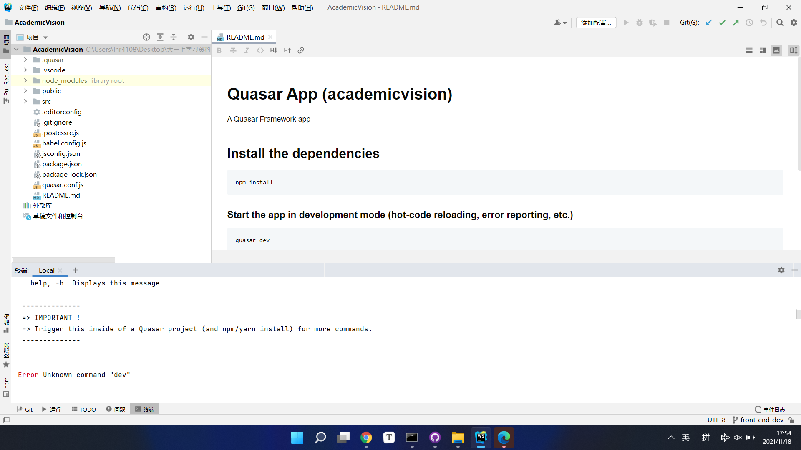
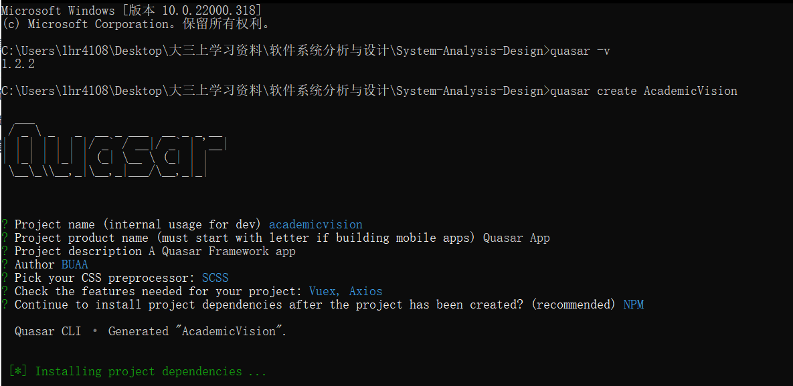
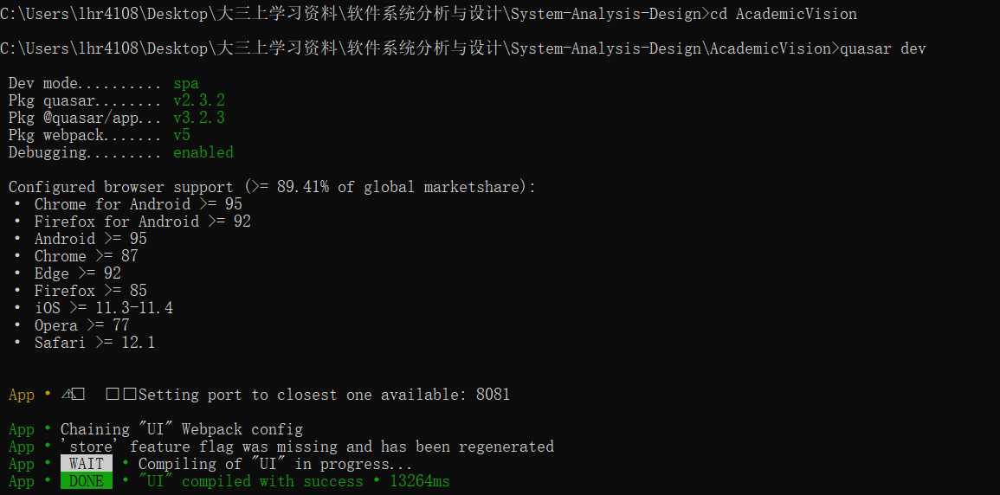
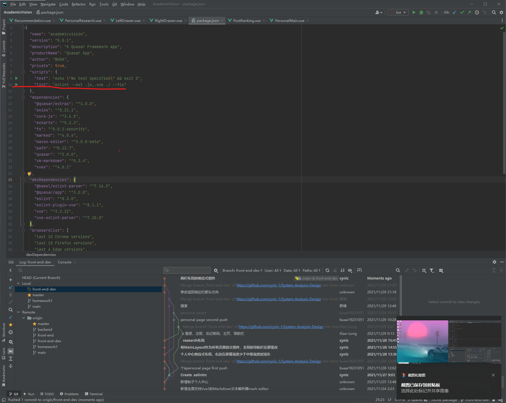

# README

## 注意事项

`front-end-dev`是开发分支，最终测试没有问题代码需要提交到`front-end`分支

如果pull项目后本地运行quasar dev指令报错

运行`Webstorm`右下角提示的`npm install`命令即可

## 安装Quasar

首先，随便打开一个文件夹，在地址栏输入`cmd`，敲击回车
打开命令行窗口后，输入`npm install -g @quasar/cli`，执行Quasar全局安装指令

等待几分钟后，安装完成

## 创建项目

在`cmd`中输入`quasar create <项目名称>`

等待几分钟后，项目创建成功

创建项目时会让你进行选择，比如输入作者，备注，选择vue版本，选择插件（一般选择关闭`Eslint`语法检查）

> 如果好几次创建都提示无法连接到网站错误时，重启计算机解决

## 运行项目

cd 项目名称

进入项目后，运行`quasar dev`指令，等待几秒后，项目运行成功，网页一般会自动打开

## 版本信息

项目添加了Vuex，Axios功能，取消了Eslint语法检查

`quasar`版本：`1.2.2`

项目名称：`academicvision`

项目作者：`BUAA`

## 项目启动

## ESlint 使用方法

