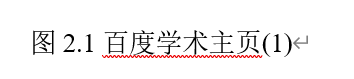
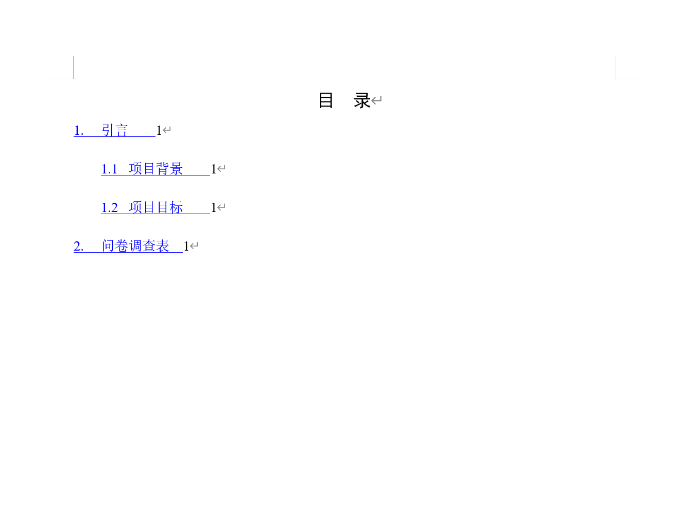
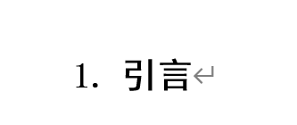

文档存在的问题

1. 需求调研报告的目录和其他报告不一致

这是需求调研

这是竞品分析

2. 各级标题的表示方法不同——要统一！！！！！！！！

这是竞品分析的

这是访谈

3. 访谈文档鱼骨图太小看不清

4. 图表的图题表题的格式不对，我的问题，格式上没法统一导出，普遍文档都存在这个问题，需要手动改。

   

5. 竞品分析没有按照最新push版本导出，有错误

此处应改为十

6. 所有的表格内的文字内容应该按照会议记录文档中的格式，而不是如竞品分析中的格式，我误解了老师给的标准的意思，把表题的格式当成表格中文字的格式了，所以用我的模板导出的表格都错了
7. 访谈记录的“访谈报告”这个标题需要加粗，这也是我的格式疏漏，需要统一改正

8. 问卷调查文档的目录非常奇怪，需要统一

9. 问卷调查文档的二级标题格式错误，不应该加粗，需要去除加粗，包括后续的二、三也是一样 

10. 由于问卷分析文档也是郭睿写的，同样存在和问卷调查文档一样的目录和标题格式错误问题
11. 问卷分析文档的图片没有图题，即图1.1 .。。。
12. 我建议没有修改的ppt不要放在文件中，至少需要按照老师说的进行修改