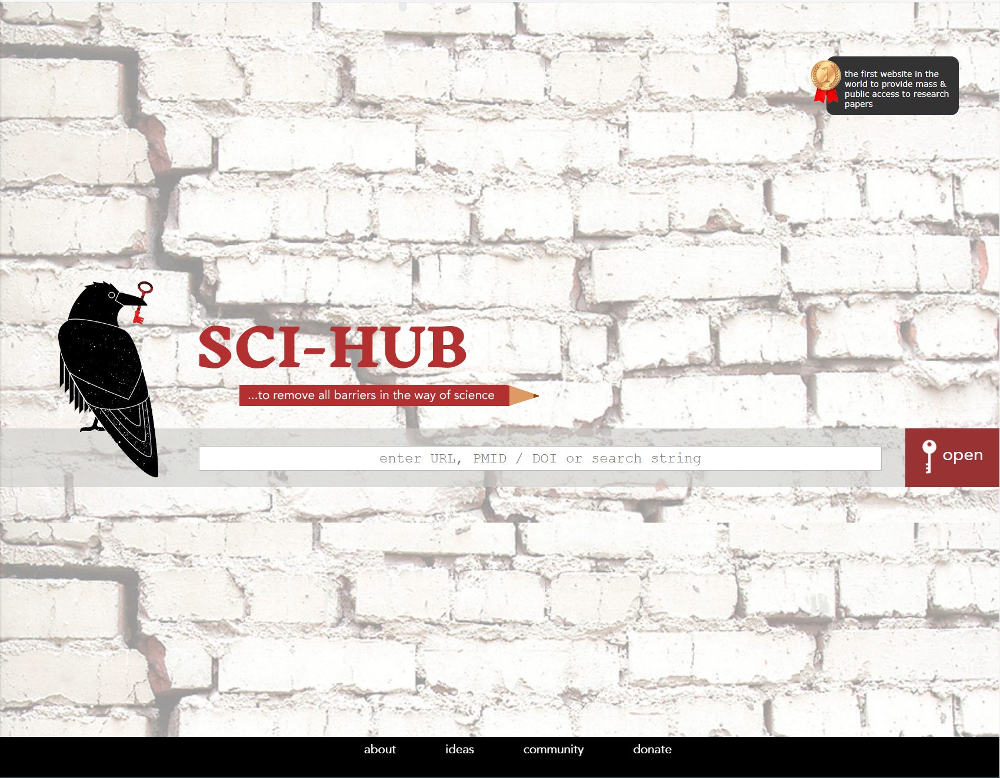
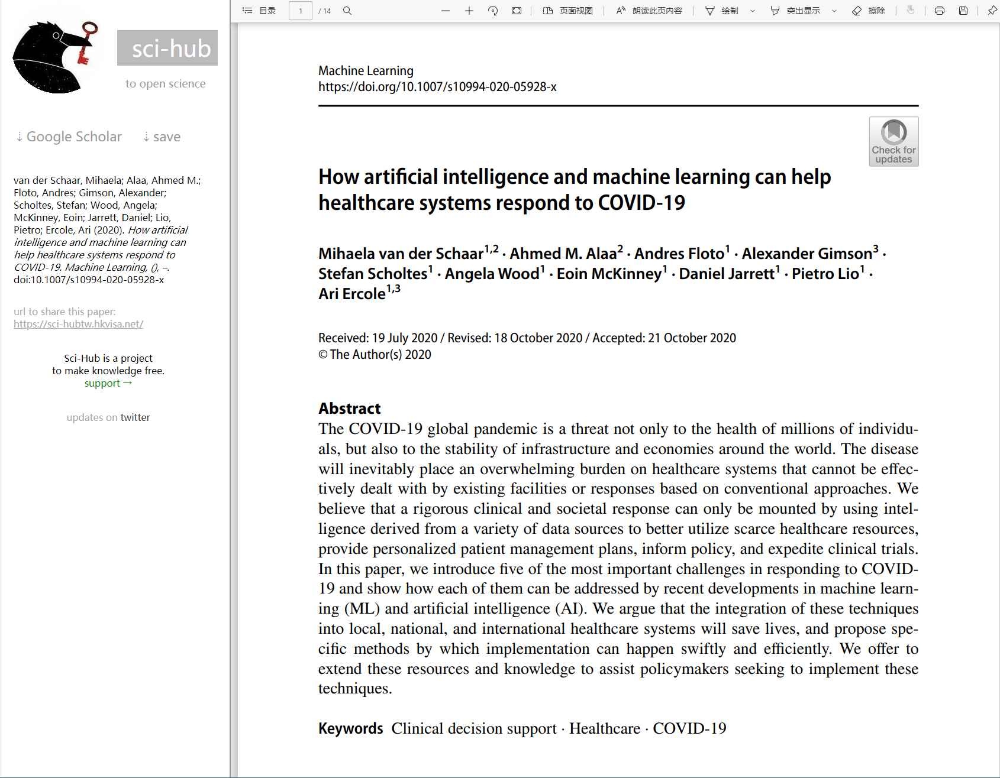

[TOC]

# 软件系统分析与设计

##### Academic Vision 学术成果分享平台

###### 竞品分析报告

# 一、项目概述

## 1.1 背景介绍

​		学术成果是指系统的、专门的或者在对存在物及其规律的学科化论证方面所取得的成就和成绩。典型的学术成果包括发表于学术期刊或会议上的学术论文、授权的专利、主持的科研项目等等。学术成果来自于科研从业人员，科研从业人员一般来自于高等院校、科研院所或高新企业等不同的学术科研机构，其成果一般隶属于其所在的科研机构。随着国家对科技创新的日益重视，这些学术成果正变成日益宝贵的企业和社会资源。如何有效地实现学术成果分享并进一步推动科研合作正成为科学技术领域的热门话题。

## 1.2 项目目标

​		本项目定位建设一套面向广大科研从业人员的学术成果分享平台。该平台由专门的管理机构运行和维护，按照不同的学术领域分类管理学术成果，同时为认证通过的科研从业人员建立个人门户系统，以维护个人学术成果。

## 1.3 基本的运行与管理机制

（1）通过公共数据库、网络爬取等多种手段获得科研人员和其对应的学术成果，经过相应的数据处理和清洗后，建立系统的基础成果数据库。同时，为保证数据的时效性，应考虑一定的数据更新机制，根据数据的特点，建立相应的更新策略。

（2）学术成果按照学术领域分类管理，提供分类过滤和检索功能。此外，学术成果还应以成果的所有人（即科研人员）的视角统一展示，从而形式各科研人员的门户。科研人员可以认领其门户，认领通过（需要建立一定的审核机制，保证是本人认领）的可以管理其学术成果。门户系统应展示：科研人员的基本信息和专业技术领域等基础内容，以及其发表的所有的论文、科研项目和专利等学术成果。

（3）普通用户可以检索和查看各类系统的科技人员信息、以及各类学术成果。

（4）系统应提供对科研人员、学术成果进行有效的统计和分析功能，实现诸如专家关系网络、科研机构成果分类排名、科研领域热点分析等功能。

（5）系统一期定位于学术成果的共享，后期成熟后应考虑提供有偿增值服务，如科技成果转让、论文全文下载和专利转让等业务功能。

（6）具备一定的社交属性，能支持科研人员的交流、资源分享、讨论等功能。

# 二、竞品对象

**竞品一：知网**

​		知网的概念是国家知识基础设施（National Knowledge Infrastructure，NKI），由世界银行于1998年提出。CNKI工程是以实现全社会知识资源传播共享与增值利用为目标的信息化建设项目，由清华大学、清华同方发起，始建于1999年6月。在党和国家领导以及教育部、中宣部、科技部、新闻出版总署、国家版权局、国家发改委的大力支持下，在全国学术界、教育界、出版界、图书情报界等社会各界的密切配合和清华大学的直接领导下，CNKI工程集团经过多年努力，采用自主开发并具有国际领先水平的数字图书馆技术，建成了世界上全文信息量规模最大的"CNKI数字图书馆"，并正式启动建设《中国知识资源总库》及CNKI网格资源共享平台，通过产业化运作，为全社会知识资源高效共享提供最丰富的知识信息资源和最有效的知识传播与数字化学习平台。（一般评定职称所说的中国期刊网，是中国知网）。

​		CNKI工程的具体目标：一是大规模集成整合知识信息资源，整体提高资源的综合和增值利用价值；二是建设知识资源互联网传播扩散与增值服务平台，为全社会提供资源共享、数字化学习、知识创新信息化条件；三是建设知识资源的深度开发利用平台，为社会各方面提供知识管理与知识服务的信息化手段；四是为知识资源生产出版部门创造互联网出版发行的市场环境与商业机制，大力促进文化出版事业、产业的现代化建设与跨越式发展。

​		凭借优质的内容资源、领先的技术和专业的服务，中国知网在业界享有极高的声誉，在2007年，中国知网旗下的《中国学术期刊网络出版总库》获首届“中国出版政府奖”，《中国博士学位论文全文数据库》、《中国年鉴网络出版总库》获提名奖。这是中国出版领域的最高奖项。国家“十一五”重大网络出版工程-----《中国学术文献网络出版总库》也于2006年通过新闻出版总署组织的鉴定验收。

**竞品二：百度学术**

​		百度学术搜索是百度旗下的提供海量中英文文献检索的学术资源搜索平台，2014年6月初上线。涵盖了各类学术期刊、会议论文，旨在为国内外学者提供最好的科研体验。

​		百度学术收录了包括知网、维普、万方、Elsevier、Springer、Wiley、NCBI等的120多万个国内外学术站点，索引了超过12亿学术资源页面，建设了包括学术期刊、会议论文、学位论文、专利、图书等类型在内的4亿多篇学术文献，成为全球文献覆盖量最大的学术平台，在此基础上，构建了包含400多万个中国学者主页的学者库和包含1万多中外文期刊主页的期刊库。以上强大的技术和数据优势，为学术搜索服务打下了坚实的基础，目前每年为数千万学术用户提供近30亿次服务。

​		百度学术目前提供以下两大类服务：学术搜索能够支持用户进行文献、期刊、学者三类内容的检索，并支持高校&科研机构图书馆定制版学术搜索，而学术服务主要提供收藏文献和购买文献等服务。

**竞品三：Sci-Hub**
​		Sci-Hub是一个影子图书馆，其上提供超过8500万篇科学学术论文和文章[1]。网站透过“.edu”代理伺服器访问相关页面，每天会上传新的论文文章[2][3][4]。

​		Sci-Hub 是目前已知第一个提供大量自动且免费的付费学术论文的网站，使用者不需要事前订阅或付款[12]，就能够使用原本存放在付费资料库的论文文章，并提供搜寻原先出版社网站内的文件档案服务。其中这些档案都是透过世界各地匿名学者提供的使用帐号，透过这些帐号使得网站能够取得JSTOR、施普林格科学+商业媒体、赛吉出版公司、爱思唯尔等出版社所拥有的论文，并将之加以集结。当用户向 Sci-Hub 提交论文请求时，网站会先搜寻创世纪图书馆是否有可提供的档案；如果创世纪图书馆并没有事先储存，Sci-Hub 会以特定资料库的帐号下载文章，并送至创世纪图书馆备份以供将来使用。

**竞品四：谷歌学术**

​		Google学术搜索是一个可以免费搜索学术文章的网络搜索引擎，由计算机专家阿努拉·阿查雅（西班牙语：Anurag Acharya）开发。2004年11月，Google第一次发布了Google学术搜索的试用版。该项索引包括了世界上绝大部分出版的学术期刊。

​		Google Scholar 索引了出版文章中文字的格式和科目，能够帮助用户查找包括期刊论文、学位论文、书籍、预印本、文摘和技术报告在内的学术文献，内容涵盖自然科学、人文科学、社会科学等多种学科。BETA版本于2004年11月发行，收录欧洲和美洲地区最大学术书版商们共同评定(peer-reviewed)的文章，这在一般搜索引擎大部分是被忽略的。这个功能和 Elsevier, CiteSeerX和getCITED所提供的免费概况查阅是类似的。它也与Elsevier的 Scopus以及Thomson ISI的 Web of Science网络科学中的订阅工具类似。谷歌学术的广告标语是“站在巨人的肩膀上”这也是对所有学术工作者的肯定，他们在过去的几个世纪中贡献了各自领域的知识，并为新的智慧成就奠定了基础。目前，Google公司与许多科学和学术出版商进行了合作，包括学术、科技和技术出版商，例如ACM、Nature、IEEE、OCLC等。这种合作使用户能够检索特定的学术文献，通过Google Scholar从学术出版者、专业团体、预印本库、大学范围内以及从网络上获得学术文献，包括来自所有研究领域的同级评审论文、学位论文、图书、预印本、摘要和技术报告。

**竞品五：万方数据**

​		万方数据知识服务平台是在原万方数据资源系统的基础上，经过不断改进、创新而成，集高品质信息资源、先进检索算法技术、多元化增值服务、人性化设计等特色于一身，是国内一流的品质信息资源出版、增值服务平台。

​		万方数据知识服务平台整合数亿条全球优质知识资源，集成期刊、学位、会议、科技报告、专利、标准、科技成果、法规、地方志、视频等十余种知识资源类型，覆盖自然科学、工程技术、医药卫生、农业科学、哲学政法、社会科学、科教文艺等全学科领域，实现海量学术文献统一发现及分析，支持多维度组合检索，适合不同用户群研究。万方智搜致力于“感知用户学术背景，智慧你的搜索”，帮助用户精准发现、获取与沉淀知识精华。万方数据愿与合作伙伴共同打造知识服务的基石、共建学术生态。

**竞品六：ResearchGate**

​		ResearchGate是一个社交网络服务网站，于2008年5月上线。

​		网站旨在推动全球范围内的科学合作，用户可以联系同行，了解研究动态，分享科研方法以及交流想法。创办人Dr. Ijad Madisch, Soeren Hofmayer 与Horst Fickenscher 三位先生，为了让科研进入新时代而建立了ResearchGATE全球化的线上社会。至今日已经有300，000 多来自196不同国家的科学家加入此共同体。

​		在ResearchGate上，科学家可以分享研究成果、学术著作，以及参加一些科研论坛或兴趣小组。一些需要向社会公布的科研项目或成果也可以提前在社区里宣布，让大家讨论并提出建议等。ResearchGate里是禁止广告的，对注册的会员也有比较严格的要求，而且网站也不会接受一些第三方的项目。

​		经过初步问卷调查和网上资料查阅，根据对在国内使用人数、面向对象、受欢迎程度、数据库丰富程度、地域差异、搜索模式相似性、功能全面性等方面进行比较分析后，我们拟定将知网作为主要竞品，其他五个网站作为次要竞品。

# 三、竞品一——中国知网分析

## 3.1 定位、功能和用户人群

### 3.1.1 产品定位

全球最大的中文数据库，全球资源规模最大的数字内容出版商、最前沿的知识管理与增值服务平台提供商，在党和国家领导大力支持下，有天然优势，是国内最大最权威知识平台。

### 3.1.2 产品功能

（1）中国知识资源总库：提供CNKI源数据库、外文类、工业类、农业类、医药卫生类、经济类和教育类多种数据库。其中综合性数据库为中国期刊全文数据库、中国博士学位论文数据库、中国优秀硕士学位论文全文数据库、中国重要报纸全文数据库和中国重要会议文论全文数据库。

（2）数字出版平台：数字出版平台提供学科专业数字图书馆和行业图书馆。通过与期刊界、出版界及各内容提供商达成合作，成为集期刊杂志、博士论文、硕士论文、会议论文、报纸、工具书、年鉴、专利、标准、国学、海外文献资源为一体的、具有国际领先水平的网络出版平台；

（3）文献数据评价：《中国学术期刊影响因子年报》系列数据库的研制出版旨在客观、规范地评估学术期刊对科研创新的作用，为学术期刊提高办刊质量和水平提供决策参考。一系列全新的影响因子指标体系，全方位提升了各类计量指标的客观性和准确性。

（4）学术服务：本身具备数据库，提供涵盖众多领域的知识资源，具有分类统计、知识检索（包括文献检索、知识元检索、引文检索、指数搜索、翻译助手、图形搜索、分组和排序展示检索结果等）、专业主题、学术资源、文献分析、引文分析、学者成果库等诸多功能，并提供各种格式的文献付费下载服务。

### 3.1.3 用户人群

目标用户包括科研人员（学生/教授）、专业领域公司职员及对相关领域感兴趣的非科研人员等三类。

## 3.2 设计和技术

### 3.2.1 交互和体验

从UI及交互上分析：主要分析用户使用频率最高的四个交互页面

图1.1 知网主页

首先是知网的主页，知网的主页比较简洁明了，所有模块都在主页很有效的进行了分类和分块，位于上方的是使用频率较高的各种检索功能选择，下方的模块都有直接分好类的主题，可以通过点击访问，同时满足了有专一目的性的访问和了解性或大范围宽泛性查找的访问需求，内容丰富全部，但与此同时页面设计并不够精细，功能做得全面，导航分了几种形式，对新用户来说不太友好，可能会不知从何下手。

检索步骤而言，提供了多方面的检索，包括多条件的高级检索，步骤细致，检索项覆盖面广，但步骤较为繁琐，需要用户经过一定思考，一定程度上会影响可用性；另一方面，虽然检索功能多，但缺乏功能的直观性，未提供简要的功能介绍或检索示例（虽然有使用手册，但是必须点高级搜索跳转另一页面后才可在右侧栏中找到），纯靠用户去摸索，在面对搜索要选择的诸多可选选项时对新用户有些不友好，包括知识元搜索中的指数搜索等功能，未加解释都会有些意义不明。

图1.2 知网高级查询页面

点击高级检索，跳转高级检索页面，如图1.2，右侧有检索说明，左侧检索栏展示检索条件和选择检索方式，页面高效简洁。

图1.3 知网查询结果页面

查询结果页面能进行多方面的筛选和排序，结果以表格形式展示，也很直观，还可以进行批量操作，用户友好度很不错。

图1.4 知网论文下载页面

知网的论文下载页面也很简洁，提供了四种获取论文的方式，同时下方有相关推荐，方便用户进行相关访问。

### 3.2.2 视觉与风格

​		从3.2.1中图片可以看出中国知网的网站风格偏中规中矩，没有特别亮眼的地方，几个基本网页基本不会有与学术无关的内容，虽然作为网站来说有点严肃，但作为学术成果分享平台，一定程度上也很符合学术氛围。

### 3.2.3 亮点功能和核心技术

（1）学术成果分类管理：  根据基本特征分为10个大类：基础科学、工程科技Ⅰ辑、工程科技Ⅱ辑、农业科技、医药卫生科技、哲学与人文科技、社会科学Ⅰ辑、社会科学Ⅱ辑、信息科技、经济与管理科学。根据文献涉及具体内容10个大类里又细分为400多个学科，在学科分类的数量和细度上区分严谨而细致。

（2）强大的分类过滤和检索：16个检索选项：关键词、主题、篇关摘、篇名、全文、作者、第一作者、通讯作者、作者单位、基金、摘要、小标题、参考文献、分类号、文献来源、DOI，基本包含了文献所具有的所有特征；可检索字段丰富，包括期刊、学位、会议、报纸、年鉴、专利、标准、成果，每种学术成果都有一些特有的检索字段，基本涵盖所有主要特征，如成果特有关键字段：成果名称、成果简介、成果完成人、第一完成单位、单位所在省市、合作完成单位；高级检索功能强大，按照可检索字段+逻辑表达式筛选数据库（可模糊）；检索与过滤结合优秀：检索后可根据主题、发表年度、研究层次、作者、机构、基金这6个不同的分组进行过滤浏览，六大分组下还根据具体内容有不同的小分组过滤。

（3）门户展示：板块内容包括基本信息、学术成果、关系网络，展示内容基本完善；  个人门户访问途径方便，可直接搜索作者名，在文献简介、搜索结果、主页等位置提供链接，或通过相关学者的页面直接进入  ；可以方便地通过门户网站进入相关内容界面，直接访问本作者所有文献及相关信息、直接访问相关学者的主页。

（4）全面的统计和分析功能：以合作关系、文章引用关系和文章被引用关系为依据构建专家关系网络，在学者库的个人展示页面展示专家关系网络；科研机构成果分类排名根据获得的荣誉以及被引用次数综合决定，范围包括国内、世界级等；根据某些热度计算方法和提取方法进行科研领域热点分析和推送。

## 3.3 运营和商业化

### 3.3.1 运营模式

（1）营销推广：有国家和政府支持的天然优势

（2）内容建设：完善数据库的构建，和多家期刊、报社等数据来源长期合作、紧密联系，从而保证数据的完整和实时

（3）品牌提升：通过和全国主要高校、科研所、图书馆等科研场所合作，深入学生市场，同时对学生提供一定的优惠折扣，从而在主要用户间打响品牌

### 3.3.2 盈利模式

知网的广告投放很少，几乎不以此盈利。主要是利用内容收费，知网在学术成果方面的数据资源接近于垄断式，论文的下载的费用很大一部分到了网站手里，作为一个数据库资源类型的网站，盈利方式就是出租出售数据资源，同时还有衍生的增值服务，包括充值和会员制的盈利，另外还有各个高校图书馆的年费。

### 3.3.3 市场推广

由于用户对象大部分是科研人员，主要通过和高校、科研机构、机关企业、图书馆、主要期刊和报纸产生合作关系来完成市场推广。

## 3.4 用户数据

### 3.4.1 用户数量和活跃度

根据2020年统计结果，用户覆盖全球56个国家和地区的3.３万家机构，个人读者2亿人，日访问量1600万人次，全文年下载量23.3亿篇。中国机构用户数量达3.2万家，含港澳台340家，覆盖全国的教科研、党政军、农工卫、工青妇、新型智库等各行各类组织机构。领域分布于电子、能源、化工、汽车、航空航天、环保等诸多技术密集型行业及政府决策、金融证券、文化传承、公共服务、文物保护等关乎国计民生的重要领域。

### 3.4.2 地域差异

在国内都是最大最权威的知识平台，地域差异主要体现在国内和国外的差异

## 3.5 优缺点总结和借鉴

### 3.5.1 优点总结

（1）基础成果数据库完善。

（2）数据更新机制合理。

（3）学术领域和学科分类细致。

（4）分类过滤和检索字段完善。

（5）学术资源针对性强，准确性高，引用格式准确，支持在线阅读和直接下载。

（6）统计和分析功能全面，可以推送学科热点。

（7）根据多方面构建关系网络，满足不同需求。

### 3.5.2 缺点总结

（1）页面设计不够精细，关于检索的操作功能多确实很好，但或许能通过修改UI或添加提示等方式让新用户有更好的体验，不至于面对这些检索条件不知所措。

（2）检索步骤较为繁琐，需要用户经过一定思考，影响可用性。

（3）用户方面，对用户的划分、用户门户展示、科研人员门户认领与操作等用户管理操作缺乏。

（4）跨库检索文献来源渠道有限，不提供资源求助功能。

（5）知网官方账号价格太贵，没有达到全民使用。

### 3.5.3 借鉴

考虑需求和开发能力、时间等因素，在优点总结中的（2）（3）（4）（5）都是为了满足基本需求要达到的，这方面知网做得特别好，值得多加借鉴，其中的（6）和（7），因为技术的上限，在数据分析全面性和热点分析算法等方面可能最后不一定能做到知网的程度，但仍是开发的努力方向，（1）是一个学术成果分享平台最关键最能吸引用户的因素，在实现（1），爬取足够全面的资源上，应该付出足够多的开发精力和资源。在知网做得不太好的地方，首先我们考虑在UI上做得更精细易懂一点，然后再合适的位置插入功能简介，另外希望完善用户门户管理方面的内容，能对用户进行一定的划分和用户门户展示。

# 四、竞品二——百度学术分析

## 4.1 定位、功能和用户人群

### 4.1.1 产品定位

​		百度学术搜索是百度旗下的提供海量中英文文献检索的学术资源搜索平台，致力于将资源检索技术和大数据挖掘分析能力贡献于学术研究，优化学术资源生态，引导学术价值创新，为海内外科研工作者提供最全面的学术资源检索和最好的科研服务体验。

### 4.1.2 产品功能

1、学术主页

​		（1）学术首页：百度学术主站的导航页，提供常用功能和常用数据库入口，首页会定期更新最新、最热论文排行和学术资讯。

​		（2）咨询导航：具体功能如下

​		重要功能入口：提供“论文查重”、“学术分析”“期刊频道”、“学者主页”、“开题分析”、“文献互助”六大重要功能的快捷入口，点击对应标签直接跳转至相应功能；

​		常用数据库导航：支持常用数据库个性化设置。可实现热门数据可增加/删减，手动添加其他网站网址等功能；

​		高被引论文排行：提供当前学科分类下，近一年资源被引量TOP10论文排行展现，点击即可跳转至具体文献。用户可根据学科门类进行筛选，排行榜每天刷新；

​		热门论文：根据全网资源近30天浏览量排名展现热门论文TOP10，排行榜每日更新；

​		热门关键词：根据全网关键词近30天搜索排名展现热门关键词TOP10，排行榜每日更新；

​		活动专区：活动专区以静态/动态图片展示百度学术相关活动资讯，点击图片可跳转至对应内容；

​		其他信息：提供“常见问题”、“论文知识”、“学术视界”、“合作活动”等模块，展示百度学术近期活动、常见问题以及学术资讯。

​		（3）用户中心：具体功能如下

​		任务中心：完成每日任务积累经验、财富、等级；

​		兑换商城：使用财富值兑换优惠奖励；

​		我的财富：查看当前财富数值，以及财富收支情况；

​		帮助中心：获取使用帮助；

​		消息中心：获取站内/系统消息。

2、学术搜索

​		学术搜索是百度学术提供的基础功能，也是用户使用频率最高的功能，支持用户进行文献、期刊、学者三类内容的检索，并支持高校&科研机构图书馆定制版学术搜索。

​		（1）文献检索：能够识别并且满足多种不同表达方式的检索需求，并提供一系列精细化小功进一步打磨用户体验。具体功能如下

​		基本检索：关键字/主题检索、标题检索、DOI检索、参考文献检索等；

​		高级检索：利用高级语法直接进行检索；

​		文献下载：百度学术不仅收录了同一篇文章的多个来源，并且在用户检索步骤提供了多个下载入口；

​		文献引用：在文献功能区提供了单篇引用和批量引用功能，用户可根据情况来选择使用；

​		排序筛选：在检索结果页，提供筛选、排序功能，可按照中/英文转换进行结果筛选，也可按照相关性、被引量、时间进行排序，默认排序方式为相关性；

​		结果展示：可进入某一条检索结果的详细页面，该页面主要展示来源期刊、引用走势、研究点分析、文献关系等内容。

​		（2）期刊频道：百度学术为了适应广大用户对于期刊检索、影响因子获取、发文周期等信息的了解需要，打造了期刊频道这一功能，主要提供期刊检索和期刊库两大功能。

​		期刊检索：直接检索、期刊库检索、分类筛选

​		期刊库：期刊库包含百度学术目前收录的所有期刊，主要提供期刊封面、期刊信息、期刊收录论文浏览、最近浏览记录、同类期刊推荐、排序筛选等功能。

​		（3）学者主页：学者是学术文献的生产者，也是百度学术的使用者。学者主页一方面帮助用户通过追踪其他学者的研究进展来了解最新研究动向；另一方面学者本身也可以通过更新个人主页，管理自己的研究成果，方便在职称晋升、基金申请、个人宣传时使用。

​		其中，学者个人主页主要包括ScholarID、学者信息、学术成果列表、数据可视化分析、合作关系等。

3、学术服务

​		（1）订阅：目前支持对关键词进行订阅，当有与关键词相关且符合订阅设置的新研究成果出现时，会自动推送到用户，推送频率为每周2~3次，推送包括系统消息推送、邮箱推送、微信推送三种。

​		（2）收藏：支持用户随时随地收藏所需文件，并支持分类标签、批量导出、文献详情、关联文献、全文阅读/添加备注等操作。

​		（3）论文查重：可上传待检测论文选择所需查重系统进行论文查重，并查看自己的查重报告。

​		（4）学术分析：学术统计分析平台，通过对百度学术海量数据资源统计、分析，选出行业内优秀的科研成果、科研学者、科研机构和学术期刊，并深度挖掘各类对象间引证关系，为相关研究人员和科研管理部门提供专业、及时的学术计量统计分析服务，为相关评价工作提供基础数据参考。

​		（5）开题分析：共包含三大类功能点——可视化分析、多维度论文推荐、关键词添加/推荐。

​		（6）文献互助：为方便用户获取文献全文，百度学术搭建了用户与用户之间的文献互助平台，方便用户进行以学术交流为目的的资源共享，极大地提高了用户获取全文的便利性，降低了获取成本。

​		（7）单篇购买：百度学术支持用户通过百度学术直接购买国外合作数据商的文献。

### 4.1.3 产品用户人群

​		目标用户包括科研人员（学生/教授）、专业领域公司职员及对相关领域感兴趣的非科研人员等三类。

## 4.2 设计和技术

### 4.2.1 交互和体验

部分UI设计如下图所示：

图2.1 百度学术主页(1)

图2.2 百度学术主页(2)

​		百度学术主页提供了多种功能的入口，对所有模块都进行了有效的分类和排版，其中位于最上方的是检索功能的选择，可以根据需求进行选择检索，在其下方则是站内功能和导航，可以根据自己不同的需求点击相应按钮，进入到所选功能对应的界面。同时，在其下方还紧跟社会最新状态，实时更新热门搜索的论文和关键字，并且可以通过点击你感兴趣的论文，跳转到该论文的查看界面。在此下方百度学术还设置了专门的活动专区，可根据时事进行更新，并且用户也可通过点击进行参与或了解更多详情。

​		就检索步骤而言，可进行一框式搜索、高级搜索、以及导航至其他学术网站搜索等功能。其简单易操作，文字精简，符合可用性定律，不需用户过多思考；但就高级搜索功能而言，其选择项过少，不利于用户根据需求进行准确精密的查找。

图2.3 检索结果页面

​		检索结果界面的设计也十分简洁，可进行收藏、引用、报错、分享等操作，同时，也会给用户推荐相似文献，来满足用户的需求。

图2.4 论文查重页面

​		百度学术提供专门的论文查重功能，页面设计及操作都十分简洁，可以根据需求选择所需要的查重系统进行查重。

图2.5 学术分析页面

​		百度学术也提供了学术分析功能，此页面有对于各个功能的简介，帮助用户进一步了解该页面的各个功能，其设计也十分的美观。

图2.6 期刊频道页面

​		百度学术的期刊频道页面与大部分书城的页面设计十分相似，不仅美观，而且能让用户根据期刊类型、期刊名等信息十分迅速的找到所需要的期刊，并且向用户展示了各个期刊的部分信息，让用户能够初步了解该期刊，方便用户阅览该页面。

### 4.2.2 视觉与风格

​		从以上图片可以看出百度学术在UI设计上属于时尚潮流的风格，延续了搜索引擎的风格，紧跟社会最新动态，从“用户体验要素”中的框架层去看，百度学术的界面设计做到了“提供做某事的能力”的效果，具备一些独特且实用的站内功能（开题分析、高被引论文等）。

### 4.2.3 亮点功能和核心技术

亮点功能：

​		（1）论文查重：百度学术给用户提供了专门的论文查重页面，用户可以根据自己所需系统进行选择，然后上传待查重文件，在此网站即可完成查重和查看结果等事宜。

​		（2）热门关键字和热门论文的首页展示：根据全网资源近30天浏览量排名展现热门论文和热门关键字的TOP10，且每日都会更新，紧跟时事，方便用户了解当前最热门的事物。

​		（3）学术分析：通过对百度学术海量数据资源统计、分析，选出行业内优秀的科研成果、科研学者、科研机构和学术期刊，并深度挖掘各类对象间引证关系，为相关研究人员和科研管理部门提供专业、及时的学术计量统计分析服务，为相关评价工作提供基础数据参考。

​		（4）学者主页：提供了个性化页面管理，每个人都可以注册自己的学者账号，并由此发表和认证独属于自己的学术成果，并且也可查看他人的个人主页，可以交到很多志同道合的朋友。

核心技术：

​		百度学术的核心功能是一个综合性学术资源搜索平台，本身并不具备数据库，而是为众多数据库及其学术资源提供一个搜索渠道，一边连接着学术资源供给方，另一边连接着学术资源需求方。即只提供文献来源而不收录全文，用户需跳转到文献来源数据库查看或下载文献。

## 4.3 运营和商业化

### 4.3.1 运营模式

​		营销推广、紧跟时事、品牌合作。

### 4.3.2 盈利模式

​		百度学术没有广告投入，主要依靠查重收费、单篇论文购买等进行盈利。

### 4.3.3 市场推广

​		由百度公司进行网络推广，同时，因该网站尽可能多地收集了大量免费知名文献，符合大部分人需求，由此越传越广。

## 4.4 用户数据

如下图所示，可看出百度学术所包含的文献期刊十分丰富，且用户数量也十分庞大。

图2.7 百度学术数据图

## 4.5 优缺点总结和借鉴

### 4.5.1 优点总结

（1）简单易操作，文字精简，符合可用性定律，不需用户过多思考。

（2）学术资源覆盖面更广泛全面，提供多种获取渠道，具备文献求助功能，增加获取成功率。

（3）热度计算方法比较合理，可以时事显示当前最热门的论文和关键字。

（4）用户涵盖广泛，为普通用户设置个人信息主页，可以区分为普通用户和认证通过的科研从业人员。

（5）展示内容齐全，能从中了解到文献的简要内容。

（6）具有精确的“检索词”检索功能，且检索后的过滤标签合理且完善，使用十分方便。

（7）页面设计简洁美观，各个功能都明显地展示给用户。

（8）统计和分析功能全面。

### 4.5.2 缺点总结

（1）高级搜索功能选择项过少。

（2）引用格式准确率有待提升，较老文献检索不到，文献更新速度慢。

（3）细分领域或学科的学术资源还有进一步优化空间，

（4）由文献来源网站的更新机制和自身的更新机制共同决定，具有很大的不确定性。

（5）只提供文献来源而不收录全文，用户需跳转到文献来源数据库查看或下载文献。

### 4.5.3 借鉴

​		在考虑到用户体验方面，在优点总结中的（1）（2）（5）（7）都是对用户十分友好的设定，能给用户提供很多的方便。而其余优点也是该项目所要达到的基本需求，百度学术在这些方面都设计的很不错，值得我们多去学习。同时，我们的项目也可以参照百度学术实时统计热门论文和关键字。另一重要方面，百度学术并没有自己文献的数据库，而是跳转到文献来源平台去观看和下载，对于本项目来说这也算是一个实现方法，但对于用户来说可能会感觉不是很友好，因为需要涉及到跳转到其他网站，远不如就在本网站操作方便这也是造成缺点（2）（4）（5）的原因。而如缺点总结（1）（3）所说，百度学术在检索和资源领域划分还有一定的缺陷，不利于用户对学位论文和会议论文的一些特殊需求，因此本项目在这一点上也会相对于百度学术有所改进。

# 五、竞品三——Sci-Hub分析

## 5.1 定位、功能和用户人群

### 5.1.1 产品定位
Sci-Hub 是目前已知第一个提供大量自动且免费的付费学术论文的网站，使用者不需要事前订阅或付款，就能够使用原本存放在付费资料库的论文文章，并提供搜寻原先出版社网站内的文件档案服务。

### 5.1.2 产品功能
（1）使用PubMed号下载论文。

（2）使用DOI号下载论文。

（3）利用数据库链接下载论文。

（4）利用关键词搜索查找以及下载文献。

### 5.1.3 产品用户人群

​		目标用户包括科研人员（学生/教授）、专业领域公司职员及对相关领域感兴趣的非科研人员等三类，用户群像特点为无法获取付费学术论文。

## 5.2 设计和技术

### 5.2.1 交互和体验

主要UI设计如下图所示：

图3.1 Sci-Hub首页

首页界面设计非常简洁清新，仅包含主要的搜索框和按钮，以及一些简短的关于本网站的介绍。Slogan意为要移除科学路上的所有障碍，乌鸦嘴上衔的钥匙和右侧的按钮上的钥匙都和slogan相呼应，隐喻用该网站打开阻拦在科学路上的门。

图3.2 Sci-Hub搜索结果

左边栏展示文章的相关出版信息，包含两个醒目的按钮，Google Scholar可以进入该文章的谷歌学术链接，save按钮直接对文章进行保存，还有对该文章的分享链接，使学术分享更为便利。网页的主要部分为阅读器，可以直接对该论文进行浏览。

### 5.2.2 视觉与风格

与其他学术成果分享网站相比，Sci-Hub颇具简洁风，没有花里胡哨的背景，网站的色调也偏浅色，为用户减少干扰，提供沉浸式阅读的环境。左边栏的功能也是能简则简，除下载文章这一最重要功能，只剩下谷歌学术的跳转链接和该论文的分享链接，可谓删繁就简、去伪存真，少数核心功能即可为用户打开科学大门。

### 5.2.3 亮点功能和核心技术

（1）免费论文下载。Sci-Hub最重要也几乎是唯一的功能，就是用户可以免费下载付费、免费数据库中的论文。

## 5.3 运营

### 5.3.1 运营模式

​		资源获取：通过其他资料库（e.g. Library Genesis）获得文献拷贝，通过某些学者捐赠的授权账户，或者通过黑客手段获得授权账户。

​		自发捐赠：依靠用户自发捐款或者慈善机构资助来维持运营成本。

### 5.3.2 产品推广

​		依靠用户相互之间的相互推荐，开源浪潮势不可挡。

## 5.4 用户数据

## 5.5 优缺点总结和借鉴

### 5.5.1 优点总结

（1）UI简洁清晰，核心功能突出，简单易用。

（2）学术资源覆盖面更广泛全面，且支持收费数据库中论文免费下载和快速分享。

（3）搜索后直接加载文章，可以直接进行浏览而不必下载后再阅读。

### 5.5.2 缺点总结

（1）高级搜索功能选择项过少，只支持DOI号、PMID、URL或者简单的字符串搜索，而且关键字搜索经常失败。

（2）只涉及论文的搜索与下载，不包括书籍等其他学术成果。

### 5.5.3 借鉴

​		简洁清晰的UI风格值得参考，也提醒我们要注意突出核心功能，不能喧宾夺主。同时论文的在线浏览和下载功能值得借鉴，但是借鉴颇具局限性，因为我们产品本身的核心功能不在于提供免费的论文下载，而应突出快速高效共享的特性。

# 六、竞品四——谷歌学术分析

## 6.1 定位、功能和用户人群

### 6.1.1 产品定位

谷歌学术是一个可以免费搜索学术文章的Google网络应用。该项索引包括了世界上绝大部分出版的学术期刊， 可广泛搜索学术文献的简便方法。文献来源来自学术著作出版商、专业性社团、预印本、各大学及其他学术组织的经同行评论的文章、论文、图书、摘要和文章。Google 学术搜索可帮助用户在整个学术领域中确定相关性最强的研究。

### 6.1.2 产品功能

（1）从一个位置方便地搜索各种学术资源，由于收录范围限于学术文献，将屏蔽掉网上很多不相关信息。

（2）查找报告、摘要及引用内容，对文献和期刊进行应用和引用排名

（3）通过用户的图书馆或在 Web 上查找完整的论文

（4）了解任何科研领域的重要论文

（5）了解某一作者的著述，并提供书目信息，可直接在网上搜索原文、文摘等；如果是图书，还可通过Library Search检索附近图书馆的收藏

### 6.1.3 产品用户人群

目标用户包括科研人员（学生/教授）、专业领域公司职员及对相关领域感兴趣的非科研人员等三类。

## 6.2 设计和技术

### 6.2.1 交互和体验

主要UI设计如下图所示：

图4.1 谷歌学术首页

其首页界面设计的非常简单，和Google搜索引擎如出一辙，就只有一个主要的搜索框和按钮，站在巨人的肩膀上，引用牛顿的话同时也是非常恰当的比喻。在上方有非常多选项，比如中国知网、百度学术、万方、webofknowledge等等。

图4.2 谷歌学术搜索结果

左侧可以设置结果的排序方式，比如按照日期排序，只显示某一年份，是否显示引用等等，每个网页都显示了被引用的次数以及其他的版本，还有快捷按钮可以直接快速查找相关的文章。有些带有PDF等标记的还可以快速下载。总的来说展示结果很全面，筛选排序也方便操作，结果展示很像google搜索结果界面或百度搜索结果页面，用户熟悉度高。

图4.3 图书预览

点击可预览的图书内容，可以在该网站预览，十分方便，具体论文访问会跳转论文发表的原地址，有利于论文定位。

### 6.2.2 视觉与风格

比起其他学术成果分享网站，谷歌学术更像一个搜索引擎，实际上也确实如此，它只是把各地的学术网站成果收集起来，并不具有独立数据库，同时又比直接的维基百科等搜索更有效，定位于学术成果，因此视觉风格很符合网站功能定位，简约有效，直奔主体，当时同时美感确实略欠佳。

### 6.2.3 亮点功能和核心技术

（1）利用被引用信息做反向搜索：谷歌学术的搜索列表会显示文章被引用的情况。你可以从搜索结果页顺藤摸瓜，点进其他引用了这篇文章的论文。这样能对别人怎么看这篇文章有个了解，还能看出引用者的研究方向和目的是否和你的一样。反向搜索有两个好处，除了能找到新的信息源，你还能根据被引用信息判断某篇文章是否适合出现在你的研究里。了解某文献被引情况。可直接点击Cited by...（引用数）搜索引用文献。

（2）隐身模式的搜索效果更好：用普通模式搜索时，谷歌会把你搜过的内容、点过的链接这些林林总总的行为都记下来。但好心也可能办坏事，这意味着你每次的搜索结果都会受到上次的影响，学术语境下的“猜你喜欢”这样的功能有点不合时宜。用隐身模式。你搜过的内容不会被记录，也不会影响下一次的搜索结果。

（3）创建个人学术档案：为了有条理、不在归档上浪费时间，用户可以用谷歌学术保存搜索结果，并将数据添加到“个人图书馆”中。并且能给某个特定的研究主题或兴趣领域建单独的图书馆。一旦搜到想要的结果，不管是文本、链接、书签，都能直接保存到对应的图书馆。之后想看哪个主题的搜索结果，就打开哪个图书馆，十分方便。

（4）相关文章推荐：相关文章的链接会让页面跳转到和当前搜索结果相关的其他学术资源。假如你手上资料还比较少，不妨试试谷歌学术给你的推荐的内容。

（5）高级搜索功能细分检索结果：高级搜索增加了不同参数的筛选过滤功能，确保搜到的东西对你用处最大。

（6）订阅主题：假如用户研究方向的是正在发生的事，可以给主题设置更新提醒。一旦谷歌学术发布或索引相关内容，用户也能马上知道。对很关注论文和期刊的最新发表消息的用户来说这一点会特别有用。

（7）pdf下载：与百度学术一样同样是借助其他地方的数据库的搜索结果，但谷歌学术提供了直接的pdf下载（支持pdf下载的论文）而无需跳转回最原始的论文发表地址。

## 6.3 运营和商业化

### 6.3.1 运营模式

​		营销推广：借Google的国际品牌、免费的理念进行推广

​		品牌合作：和诸多论文发表的网站合作，第一时间获取多方面的最新论文信息

### 6.3.2 盈利模式

​		主要依靠广告投入，与其他论文发表的网站建立合作收取占位费等进行盈利。

### 6.3.3 市场推广

​		借Google的国际品牌、免费的理念进行推广，同时依靠本身强大的搜索能力、数据收集能力在众多科研成果搜索网站中脱颖而出。

## 6.4 用户数据

## 6.5 优缺点总结和借鉴

### 6.5.1 优点总结

（1）UI简单易操作，文字精简，不需用户过多思考，文献搜索结果展示全面，在每个搜索结果还有直接查看相关文献、pdf下载、引用等快捷简便的实用功能。

（2） 学术资源覆盖面更广泛全面，由于本身不建立数据库，提供了多方面的跨库搜索能力。

（3）出色的订阅功能，设置提示后能及时向用户提供前沿学科知识。

（4）能利用被引用信息做反向搜索。

（6）能创建个人学术档案，能高效的进行内容归档和内容再查找。

（7）隐身模式的搜索，能避免搜索结果被之前的搜索内容影响。

（8）对于图书等某些文献，可在线查看阅读。

（9）谷歌学术搜索还包括了没有在线发布的学术研究结果。比如爱因斯坦的很多著作并未在线发布，但却被众多学者引用。

### 6.5.2 缺点总结

（1）高级搜索功能选择项过少。

（2）死链接率比较高，中文网站更新的频率不够高。

（3）谷歌学术排名波动较大，且一些不是很热的关键字的更新速度比较慢。

（4）只提供文献来源而不收录全文，用户需跳转到文献来源数据库查看。

（5）对于需要非常专业学术内容的科研人员，可能搜索结果中一部分信息的来源来自非正规网站，为了同时保留需要广泛搜索的用户，最好可以由用户选择搜索的来源范围（至少是大概的）。

### 6.5.3 借鉴

​		在优点总结中，（1）、（3）、（6）是值得我们借鉴的，而（2）、（9）等优势属于谷歌学术依托谷歌的天然优势，而我们的任务要求是要自己建立数据库，这方面的参考性就没那么强，在缺点总结中，我们考虑对（1）、（2）、（3）进行完善，同时随着其他功能的增加，也会对UI进行改进，但保留其精简有用的特点。

# 七、竞品五——万方数据分析

## 7.1 定位、功能和用户人群

### 7.1.1 产品定位

​	万方数据知识服务平台是在原万方数据资源系统的基础上，经过不断改进、创新而成，集高品质信息资源、先进检索算法技术、多元化增值服务、人性化设计等特色于一身，是国内一流的品质信息资源出版、增值服务平台。万方智搜致力于“感知用户学术背景，智慧你的搜索”，帮助用户精准发现、获取与沉淀知识精华。

### 7.1.2 产品功能

1、出版服务：

（1）资源介绍：具有众多数据库资源，如中国学术期刊数据库（CSPD)、中国学位论文全文数据库（CDDB）、中国学术会议文献数据库(CCPD)、中外专利数据库（WFPD）、中外标准数据库（WFSD）、中国法律法规数据库(CLRD)、中国科技成果数据库（CSTAD）中国特种图书数据库（CSBD）、中国机构数据库（CIDB）、中国专家数据库(CESD)、中国学者博文索引库（WFBID）、OA论文索引库(OAPID)等。

（2）检索功能：用户可以从一两个简单的检索词就可以开始一次简单、精准、快速、稳定的检索体验。在这里，用户总是能得到一个经过甄选的检索结果，真正想要的文献会优先显示在前面。用户可以通过检索结果的分布视图进行“排除”和“限定”，使检索更精准。用户也可以通过参考文献、引证文献、相似文献顺藤摸瓜。

2、增值服务：

（1）知识脉络分析：知识脉络即为以主题词为核心，根据所发表论文的知识点和知识点的共现关系的统计分析，使用可视化的方式向用户揭示知识点发展趋势和共现研究时序变化的一种服务。

（2）论文相似性检测：用于指导和规范论文写作，检测新论文和已发表论文的相似片段。它基于数字化期刊全文数据库、学位论文全文数据库等万方数据核心数据资源，可通过Web模式，快速灵活进行单篇论文检测；并率先在国内推出了支持批量检测、断点续传等功能的检测客户端。最新推出检测结果统计报告功能，并即将推出全新模式的详细检测结果报告，增加了检测报告的实用性、可读性。

（3）查新咨询服务：科技查新是一种深层次的、具有特定含义的检索工作，该功能满足查新专业用户的需求，并根据图书馆人特有的专业知识背景和需求，打造了多种专用工具。。

（4）科技文献分析：科技文献子系统由40个典型主题数据库组成，主题的选取主要来源于国家中长期科学和技术发展规划纲要-——重点领域及其优先主题，侧重社会关注高的社会焦点、热点问题，兼容国家和社会的重大需求，有未来或当前重要的应用目标。

（5）中国学术统计分析：从各主要学术领域出发，以完整准确的学术文献资源和有关数据为依据，运用科学的统计方法，从关注度、上升及下降趋势、新兴研究等几个主要方面进行研究分析，通过客观数据直观反映我国学术发展现状、情况和问题。

（6）身份证核查：联合全国公民身份证号码查询服务中心共同推出的身份证核查服务平台，是唯一经公安部和中编办批准提供全国公民身份信息服务的机构，负责“全国公民身份信息系统”的建设、管理，对社会提供全国公民身份信息服务。

（7）专利分析：以专利信息分析、竞争情报和知识挖掘等理论为基础，对专利信息进行多维统计加工、智能化定量分析和内容的深度挖掘，并将分析结果以可视化界面提供给用户。用户可根据具体需求定制数据库，一次检索，自动分析相关指标。分析流程简单化，分析指标明确化，有效引导用户进行专利分析。

3、多元服务：

（1）编审服务平台：包括作者、编辑部、专辑三个子系统，实现了作者在线投稿、查稿、修回稿件，编辑部稿件处理、组刊发布，专辑审稿等全流程的功能。

（2）作者投稿服务：方便作者获得最新权威征稿信息，轻松选定投稿期刊；方便编辑部获得更多、更有针对性的优质稿件。

（3）OA论文托管服务：让任何个人和机构都可以将符合协议的论文免费发布到该服务平台上，任何人都可以及时、免费、不受任何限制的获取平台上的所有OA论文。

（4）引用通知：引用通知是一款新的信息服务，当您所订阅的论文被其他论文引用时，您将得到即时通知。这种服务的独到之处在于可以指定一组文献，了解它们被引用的情况以及引用变更的情况。及时了解指定论文的的权威性、受欢迎程度。该服务仅面向个人注册用户。系统通过Email或RSS订阅的方式进行自动通知。

### 7.1.3 用户人群

目标用户包括科研机构人员、高校学生教授学者、图书馆、省级市级情报所、医药机构、企业机构、政府机构七类。

## 7.2 设计和技术

### 7.2.1 交互和体验

部分UI及交互上分析：

图5.1 万方主页1

图5.2 万方主页2

图5.3 万方主页3

​		首先是万方数据的主页，万方数据的主页设计十分简洁，排版也十分清晰，用户可以十分迅速地找到自己所需要的功能所在地点，并且提供了各个功能的入口，可以根据需求跳转到所需功能的界面。另一方面，万方数据还提供了当前的热门文献和热搜词，可以实时更新，让我们了解当前人气最高的学术方面。在最下方还设有最新资讯和动态，紧跟社会最新时事。

​		检索方面而言，用户从一两个简单的检索词就可以开始一次简单、精准、快速、稳定的检索体验。在这里，用户总是能得到一个经过甄选的检索结果，真正想要的文献会优先显示在前面。用户也可以通过参考文献、引证文献、相似文献顺藤摸瓜。同时也提供高级检索、专业检索、作者发文检索等多种检索方式

图5.4 万方高级检索页面

​		点击高级检索，跳转高级检索页面，如图5.4，右侧有了解高级检索，上侧也可以选择高级检索、专业检索、作者发文检索等三种高级检索方式，页面高效简洁。

图5.5 万方查询结果页面

​		查询结果页面能进行多方面的筛选和排序，结果以表格形式展示，很直观，用户也可以进行批量操作，同时，每个文献都有一定的介绍，让用户可以初步了解这些文件，来选择自己所需要的，用户体验很良好。

图5.6 万方论文展示页面

​		知网的论文下载页面也很简洁，提供了下载、在线阅读、导出、收藏、分享等功能，并且有该文献的各个详细信息，在最下方也有相关文献的推荐，帮助用户更迅速地找到所需的相关文献。

图5.7 万方查重页面

​		万方提供了特有的论文查重功能，能实现大部分学者的需求，该页面设计也十分的美观，且各个功能入口也很容易就能找到，使用起来也十分便捷。

### 7.2.2 视觉与风格

​		从以上图片可以看出万方数据在文献查询和展示界面UI还是十分简洁明了的，比较符合学术平台的需求。同时，主页、查重、分析等特色功能的界面设计则比较美观，并且伴随着相应功能的介绍，使用时有很好的用户体验感。

### 7.2.3 亮点功能和核心技术

（1）论文相似性检测服务：  是万方数据推出的特色服务，用于指导和规范论文写作，检测新论文和已发表论文的相似片段。它基于数字化期刊全文数据库、学位论文全文数据库等万方数据核心数据资源，可通过Web模式，快速灵活进行单篇论文检测；并率先在国内推出了支持批量检测、断点续传等功能的检测客户端。最新推出检测结果统计报告功能，并即将推出全新模式的详细检测结果报告，增加了检测报告的实用性、可读性。

（2）身份证核查服务：全国公民身份证核查系统是万方数据公司联合全国公民身份证号码查询服务中心（简称中心）共同推出的身份证核查服务平台，是唯一经公安部和中编办批准提供全国公民身份信息服务的机构，负责“全国公民身份信息系统”的建设、管理，对社会提供全国公民身份信息服务。

（3）移动阅读服务：移动阅读成为信息化时代的全新阅读方式，我国移动阅读的用户量呈爆炸式增长，用户需要信息更丰富、获取更容易、得到更及时。万方数据利用自身强大的资源和服务优势，结合先进的移动终端设备，精心打造万方数据移动阅读服务，使随时、随地、随意地阅读知识服务平台信息成为现实。

（4）智能化的检索推荐：提供跨语言检索、语义检索等多种智能检索方式。综合考虑用户使用情境、行为偏好、学科领域、教育背景等要素，实现智能排序调整与个性化推荐，帮助用户发现最具价值的资源。

（5）可视化的关联分析：用引文分析、共词分析、社会网络分析等方法探索检索结果的隐性知识关联，实现前沿热点追踪、发展趋势预测以及各类知识关系的可视化呈现，帮助用户直观了解主题知识的全貌，快速筛选出高价值内容。

（6）多粒度的资源揭示：依托主题词表与引文库建设，构建多维度、多层次、内容深度关联的知识组织脉络；支持检索结果的细化分层和多维聚类，帮助用户在海量资源中快速定位最佳匹配结果。

## 7.3 运营和商业化

### 7.3.1 运营模式

（1）营销推广：有国家和政府支持的天然优势，并且经常参与社会活动，举办各类研讨班、研讨会促进行业发展，同时积极进行社会资助活动，知名度得到快速提升。

（2）内容建设：完善数据库的构建，和多家期刊、报社等数据来源长期合作、紧密联系，同时承担众多国家或公司项目，不断发展自身技术。

（3）品牌提升：通过和全国主要高校、科研所、图书馆等科研场所合作，深入学生市场，同时对学生提供一定的优惠折扣，同时积极进行社会资助活动，知名度得到快速提升。

### 7.3.2 盈利模式

​		万方数据在学生学者等用户方面主要依靠论文重复性检测盈利，同时，万方也会去承担许多国家的或者知名企业、大学等的科研项目，在帮助他们开发的同时盈利。

### 7.3.3 市场推广

​		通过提供独有的论文重复性检测功能，在各大高校学生学者之间迅速推广。同时，积极参与各类社会活动，进行社会资助，承担国家企业项目等，提高社会知名度。

## 7.4 用户数据

### 7.4.1 用户数量和活跃度

国内市场：在全国设有5个负责产品销售和客户服务的全资子公司,30多个办事处。客户遍布全国34个省、市、自治区、直辖市，主要集中于高等院校、科硏机构、信息机构、公共图书馆、医疗机构、政府机构、企业等共计上万余家，及个人用户千万余名。

国外市场：目前，公司海外客户遍布世界十几个国家和地区。典型客户:英国牛津大学、加拿大多伦多大学、澳大利亚国家图书馆、德国柏林国家图书馆、美国国会图书馆、美国加州大学、耶鲁大学、美国康奈尔大学、香港中文大学、澳门大学、澳门中央图书馆、新加坡国家图书馆、南洋理工大学、合湾淡江大学等。

### 7.4.2 地域差异

地域差异主要体现在国内和国外的差异。

## 7.5 优缺点总结和借鉴

### 7.5.1 优点总结

（1）学术检索的强力入口，实现统一、高效、精准的中外文学术资源检索发现服务。

（2）多粒度的资源揭示。

（3）提供跨语言检索、语义检索等多种智能检索方式。

（4）全新的学术评价体系。

（5）UI界面设计美观，使用便捷。

（6）提供特有的论文重复性检验、身份核查、科技分析等功能。

（7）可移动阅读，可适用与手机端，且可以移动在线阅读所查文献，为用户提供了很多便利。

### 7.5.2 缺点总结

（1） 数据库比较少而且只能检测中文。

（2）在论文检测方面，万方是基于滑动窗口的低频特征部分匹配算法，但是他不测互联网的数据，虽然检测速度很快但是因为不测互联网数据，所以它的检测结果就不那么准确。

（3）万方的文献库不是每日更新而是不定期更新，容易使用户错过最新资讯。

（4）文献收录年限较短，导致可能会找不到时间较久的文献。

（5）用户方面，对用户的划分、用户门户展示、科研人员门户认领与操作等用户管理操作缺乏

### 7.5.3 借鉴

​		考虑到本项目的需求方面，万方数据的检索页面的设计和功能都十分优秀，页面设计简洁明了，同时也提供多种检索方式，能满足用户不同的需求，这点值得我们借鉴。万方数据各个功能主页的UI设计也十分美观，在UI方面可以考虑参考该网站的设计，在功能入口的旁边附加上功能介绍，帮助用户快速了解该功能的具体功效。同时，其搜索结果界面的帅选排序等功能也十分完善，可以借鉴。其他功能方面，其在线移动阅读功能对于用户来说是十分友好的一个功能，这一点本项目在制作时应该考虑实现。从缺点来讲，万方缺少一些用户管理个人的一些相关操作，这方面本项目会有所优化。

# 八、竞品六——ResearchGate分析

## 8.1 定位、功能和用户人群

### 8.1.1 产品定位

ResearchGate是一个社交网络服务网站，网站旨在推动全球范围内的科学合作，用户可以联系同行，了解研究动态，分享科研方法以及交流想法。在ResearchGate上，科学家可以分享研究成果、学术著作，以及参加一些科研论坛或兴趣小组。一些需要向社会公布的科研项目或成果也可以提前在社区里宣布，让大家讨论并提出建议等。

### 8.1.2 产品功能

（1）用户自己上传绝大部分文献资料。

（2）检索和查看科技人员信息、方便的访问个人门户。

（3）包括专家关系网络、科研领域热度分析、科研成果分类排名等统计分析功能。

（4）完善的社区功能，支持关注、私信、获取科研状态统计数据、周报、提出问题，甚至可以寻找工作。

### 8.1.3 产品用户人群

​		目标用户包括科研人员（学生/教授）、专业领域公司职员及对相关领域感兴趣的非科研人员等三类。

## 8.2 设计和技术

### 8.2.1 交互和体验

主要UI设计如下图所示：

图3.1 ResearchGate首页

首页界面设计接近社交网站的设计，是网站的简单介绍和一些图片介绍，明确了网站定位。

图3.1 ResearchGate提问

提问页面设计也偏向社交网站，包括了回答、新问题、关注、推荐、分享等诸多按钮，对于在社区内的学术交流非常方便。

### 8.2.2 视觉与风格

与其他学术成果分享网站相比，ReaserchGate更注重社交风格，风格比较时尚，模块分类清晰。

### 8.2.3 亮点功能和核心技术

（1）用户自己可以上传文献论文。

（2）以关注了哪些学者、被哪些学者关注、与他合著论文的学者排行榜为依据构建专家关系网络，在学者库的个人展示页面展示。

（3）  有评级系统RG来评估研究人员及其工作的影响，这个指标除了发表的论文数和被引数以外，还考虑了科研人员参与学术交流的活跃程度及被其他同行认可的程度。

（4）大部分文献可免费下载，有些无法下载的文献可以直接联系作者。

（5）社区交流：  我们可以关注其他研究人员的ResearchGate 账号。关注对方ID之后，你可以直接给对方私信。  你关注的学者们的所有科研动态（比如新发表的论文，会议报告，新加入的科研项目，推荐的论文，以及他的论文引用信息等）都会出现在ResearchGate网站上你个人的Home界面中。  当你发现某个文献无法下载时可以直接联系作者进行请求，作者回复后会第一时间邮件通知你。

（6）获取统计信息：  ResearchGate会提供你的科研状态统计数据。除了提供整体统计信息之外, ResearchGate还会每周向你发送一份报告，这份报告内容包括过去一周你的研究成果被阅读次数，被引次数等信息。

（7）提出问题、获得答案：第一，你可能回答的问题。系统会根据你的研究背景自动推荐；第二，你关注过的问题。只要系统上有学者给这个问题提供了新的答案，ResearchGate会第一时间通知你；第三，你已经提出的问题。如果有任何动态，ResearchGate也会第一时间通知你；第四，提出新的问题。比如你在平时做科研的过程中遇到了难解的问题或者有趣的问题，你都可以在ResearchGate 上发布这个问题。提问功能的具体使用方法如下：点击“提问”按钮，在对应位置输入问题以及对问题的详细描述，然后直接发布问题即可。

（8）招聘：首先在第一栏的搜索功能下，我们可以选择潜在的工作地区（覆盖全世界）和研究领域，此外，你还可以添加个人偏好设置。ResearchGate 会结合相关信息自动推荐你可能感兴趣的工作。除了可以找工作之外，我们还可以发布招聘启事，见上图右下角。比如你的课题组有博士空缺，或者需要博士后，以及高校需要招聘老师等都可以在上面发布信息。

## 8.3 运营

### 8.3.1 运营模式

​		文献获取主要靠用户自己上传，下载也大多免费，主要运营方向是通过发布广告或者职位招聘来盈利

### 8.3.2 产品推广

​		吸引融资、社区推广

## 8.4 优缺点总结和借鉴

### 8.4.1 优点总结

（1）大部分文献可免费下载，有些无法下载的文献可以直接联系作者。

（2）就社交向的学术交流网站来说，UI设计十分贴合网站定位。

（3）完善的社区功能，支持关注、私信、获取科研状态统计数据、周报、提出问题或获取答案。

（4）用户划分明确，有标签区别，会为用户推荐同类型的其他用户或成果，可以区分为普通用户和认证通过的科研从业人员。

（5）可以发布招聘启事和寻找工作。

### 8.4.2 缺点总结

（1）由于主要依靠用户自己上传，就搜索而言文献丰富度比其它学术网站就要低一些。

（2）检索选项不够细致，无高级检索功能。

### 8.4.3 借鉴

​		主要值得借鉴的是社区的功能，包括创建学术社区、相互关注、私信、获取学术动态、提问等，同时可以借鉴对应功能的UI设计，需要完善的地方主要是搜索功能的多样性和对搜索结果的筛选排序的多样性。

# 九、总结

## 9.1 评价表格

|              | 知网                                                         | 百度学术                                                     | Sci-Hub                                      | 谷歌学术                                                     | 万方数据                                                     | ResereachGate                                                |
| ------------ | ------------------------------------------------------------ | ------------------------------------------------------------ | -------------------------------------------- | ------------------------------------------------------------ | ------------------------------------------------------------ | ------------------------------------------------------------ |
| 视觉风格     | 风格偏中规中矩，内容丰富全面，但与此同时页面设计并不够精细，导航分了几种形式，对新用户来说不太友好 | 属于时尚潮流的风格，百度学术的界面设计做到了“提供做某事的能力”的效果 | 简洁清晰、核心功能突出                       | 更像一个搜索引擎，视觉风格很符合网站功能定位，简约有效，直奔主体，当时同时美感确实略欠佳 | 界面UI十分简洁明了的，主页、查重、分析等特色功能的界面设计则比较美观，并且伴随着相应功能的介绍 | 设计偏社交性、时尚，功能性选项按钮较多                       |
| 搜索逻辑     | 检索项覆盖面广，但步骤较为繁琐一定程度上会影响可用性。虽然检索功能多，但缺乏功能的直观性，未提供简要的功能介绍或检索示例 | 其简单易操作，文字精简，符合可用性定律                       | 搜索功能多样性差，有一定入门门槛，但准确性强 | 同大多数搜索引擎，简单易上手                                 | 简单易操作，可以通过参考文献、引证文献、相似文献顺藤摸瓜     | 搜索逻辑简单，但搜索功能比较单一                             |
| 高级搜索功能 | 检索选项基本包含了文献所具有的所有特征；特有的检索字段；高级检索功能强大 | 高级搜索增加了不同参数的筛选过滤功能，但其选择项过少         | 无                                           | 相比知网还是还是少了不少搜索选项，只提供利用不同参数的高级搜索 | 提供高级检索、专业检索、作者发文检索等多种检索方式，其中字段项主要包括多达11个检索字段 | 无                                                           |
| 数据库内容   | 本身具备数据库，提供涵盖众多领域的知识资源。                 | 本身并不具备数据库，而是为众多数据库及其学术资源提供一个搜索渠道 | 具备独立数据库                               | 本身不建立数据库，提供了多方面的跨库搜索能力，包括了没有在线发布的学术研究结果 | 收录了国内外各大数据库内容                                   | 具备数据库，内容主要靠用户上传                               |
| 获取资源     | 学术资源针对性强，准确性高，引用格式准确，支持在线阅读和直接下载（付费） | 只提供文献来源而不收录全文，用户需跳转到文献来源数据库查看或下载文献 | 可在线浏览pdf文件，同时可以直接下载。        | 用户需跳转到文献来源数据库查看；对于图书等某些文献，可在线查看阅读；不过对可下载文件提供了直接的pdf下载 | 提供了下载、在线阅读、导出、收藏、分享等功能，同时还有移动阅读服务 | 大部分文献免费下载，其他的可以主动联系作者                   |
| 个人门户     | 可直接搜索作者名，在文献简介、搜索结果、主页等位置提供链接；但缺乏对用户的划分、用户门户展示、科研人员门户认领与操作等用户管理操作 | 学者主页一方面帮助用户通过追踪其他学者的研究进展来了解最新研究动向；另一方面学者本身也可以通过更新个人主页，管理自己的研究成果 | 无                                           | 用户可以用谷歌学术保存搜索结果，并将数据添加到“个人图书馆”中。并且能给某个特定的研究主题或兴趣领域建单独的图书馆 | 个人中心，可以查看自己账号所购买受收藏等操作，提供了发帖关注和粉丝等功能，但对用户的划分、用户门户展示、科研人员门户认领与操作等用户管理操作缺乏 | 用户划分明确，个人中心，展示RG评分、学位、个人背景、所在科研单位等 |
| 学科前沿推荐 | 根据某些热度计算方法和提取方法进行科研领域热点分析和推送     | 根据全网资源近30天浏览量排名展现热门论文和热门关键字的TOP10，且每日都会更新 | 无                                           | 可以给主题设置更新提醒。一旦谷歌学术发布或索引相关内容，用户也能马上知道 | 根据某些热度计算方法和提取方法进行科研领域热点分析和推送，展现热门论文和热门关键字，实时更新 | 首页有热点内容，网站的用户也会上传有关热点内容的文献，用户也可以在相关社区对热点内容进行讨论 |
| 筛选和排序   | 检索后可根据主题、发表年度、研究层次、作者、机构、基金这6个不同的分组进行过滤浏览，六大分组下还根据具体内容有不同的小分组过滤 | 在检索结果页，提供筛选、排序功能，可按照中/英文转换进行结果筛选，也可按照相关性、被引量、时间进行排序，默认排序方式为相关性 | 搜索结果具有唯一性                           | 方便操作，但选项较少，只有基本的按时间、文献类型等筛选排序   | 智能排序调整与个性化推荐，依托主题词表与引文库建设，构建多维度、多层次、内容深度关联的知识组织脉络；支持检索结果的细化分层和多维聚类 | 功能简单、多样性欠缺                                         |
| 统计和分析   | 以合作关系、文章引用关系和文章被引用关系为依据构建专家关系网络，科研机构成果分类排名 | 选出行业内优秀的科研成果、科研学者、科研机构和学术期刊，并深度挖掘各类对象间引证关系，提供专业、及时的学术计量统计分析服务，为相关评价工作提供基础数据参考 | 无                                           | 无                                                           | 运用科学的统计方法，从关注度、上升及下降趋势、新兴研究等几个主要方面进行研究分析，通过客观数据直观反映我国学术发展现状、情况和问题。 | 专家关系网络构建和展示、包括科研成果分类排名和科研领域热点分析 |
| 特色功能     | 数字出版平台、文献数据评价、各种高级搜索功能（如指数搜索）   | 论文查重、热门关键字和热门论文的首页展示、学术分析、学者主页 | 免费阅读及下载付费数据库中的论文             | 反向搜索被引用文献、隐身模式、个人学术档案、订阅功能         | 论文相似性检测服务、身份证核查服务、移动阅读服务、智能化的检索推荐、可视化的关联分析、多粒度的资源揭示 | 社区功能：分享、关注、私信、提问、讨论、招聘、合作等一系列完备的社交功能 |

## 9.2 结论

通过竞品分析，我们主要需要借鉴的点包括：

（1）知网的高级搜索功能、多样性的筛选和排序功能、构建专家合作关系网络的依据、文献的获取方法。

（2）百度学术的UI设计、学术结果分析功能、学者页面。

（3）Sci-Hub的在线阅读和论文下载。

（4）谷歌学术的搜索结果设计（包括相关论文、被引论文的等功能快捷键）、个人档案页面，实现文献整理与归档、反向搜索，订阅学科热点推送功能。

（5）万方数据的统计方法、热点展示、个人中心页面、可视化的关联分析、多粒度的资源揭示。

（6）ResereachGate的主要社区功能：分享、关注、私信、提问、讨论等，以及构建专家合作关系网络的依据。

主要需要完善的点主要是门户的设计和学术成果的认领、UI、以及解决搜索功能多和用户友好度的矛盾。

# 十、SWOT分析

| Strengths 1. 结合公共数据库和网络爬取等多种数据获取手段，学术成果更全面、更丰富 2. 提供学术成果多种分类过滤，支持多种检索方式 3. 自动化生成科研门户，由科研人员认领，便于管理学术成果，同时可在门户与其他用户沟通交流 4. 具有基于引用关系与合作关系的专家关系网络、科研机构成果分类排名、科研领域热点分析等统计分析功能 5. 搭建科技成果转化、论文在线阅读、论文全文下载、专利转让等平台 ，加快科技成果转化，打通To C业务 | Weakness    1. 缺少论文相似性检测功能 2. 部分付费数据库学术成果无法全文阅读和下载 3. 由于运营成本的限制，数据更新的频率较低 4. 未集成在线编辑学术成果、一键投稿、一键发表功能。 |
| ------------------------------------------------------------ | ------------------------------------------------------------ |
| Opportunities  1. 学术研究人员群体逐渐扩大，国内学术成果共享仍具有较高门槛 2. 主流市场上未出现同时拥有独立数据库和科研门户的同类网站 3. 多数同类网站不支持学术成果的在线阅读 4.  国内研究人员缺乏网络沟通交流平台，但是该需求旺盛。 | Threats 1. 市场上定位相似的主流产品较多，起步阶段较难获取流量 2. 市场主流产品体量大，一些具有政策扶持，资源丰富，具有天然优势 3. 高级搜索、智能推荐、排序筛选、统计分析功能各大主流平台都已实现，难以出新意 |

