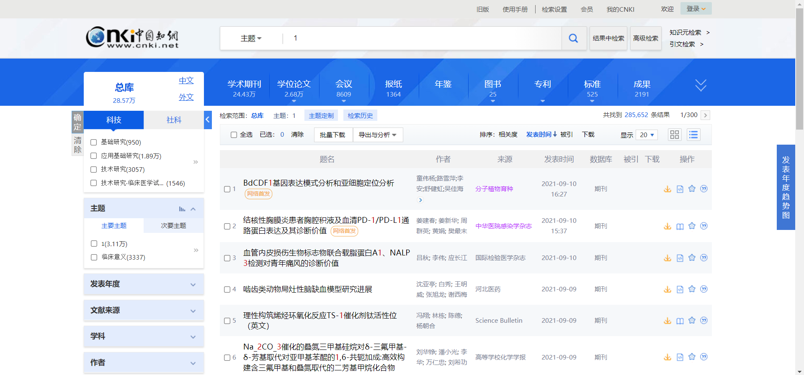

# 访谈

## 1 鱼骨图(更清晰的图片见鱼骨图文件夹内的图片)

## 2 访谈记录

### **第一部分：系统拥有者访谈记录**

#### 1

> **访谈对象**：谭火彬老师，潘海侠老师，软件系统分析与设计课程老师
>
> **访谈日期**：2021年9月9日
>
> **访问时间**：7:30 P.M.
>
> **访谈地点**：线上
>
> **备		注：**这次访谈记录来源于9月9日晚上的答辩和老师在群里的回答以及组员私聊老师的记录

| 时间 Time | 访谈问题 Interview                                           | 访谈回答 Answer                                              |
| --------- | ------------------------------------------------------------ | ------------------------------------------------------------ |
| 5min      | 这次的学术成果平台除了文档中的功能以外，是否可以添加额外的功能？ | 新功能要说服客户有用，自己小组也要讨论一下是否有用，是否合理，不要盲目的去添加额外的调查与功能，要求之外的功能能让老师同意才算好功能 |
| 5min      | 对于科研成果展示这些可视化表现形式的界面，是否一定要使用某种形式来展示，比如一定要使用词云这种形式来展示科研成果？ | 科研成果展示（项目里的一种功能）不一定要用词云，同样的其他东西的表现形式不一定只有一种，需要有多种表达形式，小组需要讨论，确定最合适的表现方法 |
| 5min      | 对于学术成果平台的搜索功能有什么建议？                       | 搜索功能可能数据量很大，后端要设计好算法，搜索是一个核心的功能，做出来速度一定要快，比如还有一些并发之类的问题，前期设计的时候就要设计好 |
| 1min-2min | 对于这次课程的需求调研功能有什么要求？                       | 和上学期的要求不一样，这次需要真的去做，比如说需求调研，真的要去做实践，问老师，做调查问卷，上网查阅资料，做竞品分析，做原型，要求更高 |
| 5min      | 如何理解需求文档中的某些新功能实现之后可以添加这种描述？     | 项目要求文档中说的要理解好，比如说里面有这样一句话：xxx成型之后可以增添xxx，那么我们就需要在建立的时候要设计好这之后要怎么加入对应的接口，要把方法写灵活，比如前端就先预留一个按钮，后端先写上一个空方法，等基本功能都完善好了再写上去 |
| 5min      | 这次对于后端关系网，数据库的设计有什么建议？                 | 根据小组实地调研，讨论分析后决定                             |
| 10min     | 需求书里的科研项目是否可以对应于知网中的成果？               | 科研项目的成果可以有多种形式：专利（ 发明专利、实用新型专利、外观设计专利）、软著、论文和专著、自主研发的新产品原型、自主开发的新技术、带有技术参数的图纸、基础软件、应用软件等。具体要展示哪些内容及如何展示你们小组自己讨论，这个作业任务给同学们很多创新创意的空间（假如你们团队用这个创业，你们会如何挖掘市场需求、提供个性化服务、如何构建产品…）当然这个产品最后要落地实现，你们需要基于需求调研论证，综合评估你们的技术能力、开发时间、成熟度等确定一些事项。以上描述不清楚之处也可以单独讨论交流。 |
| 10min     | 管理学术成果具体指什么呀？                                   | 学术成果的管理是对已认证专家提供的服务，这个部分做好可以更好地吸引专家入驻（毕竟平台产品需要流量、需要日活、月活量等）。这些功能既包括通用服务需求(如增删改、查询、统计、可视化展现等），也可提供个性化数据分析、数据挖掘、知识图谱等（这需要深入分析、仔细讨论推敲确定）。还要注意simple 原则… |
| 5min      | 请问swot分析是针对每一种竞品做还是针对我们的产品做呢？如果是针对我们的产品做，那我们的产品很多功能还未明确，好像不太好进行分析啊 | 这个自己把握。理论上来讲，你要分析它，当然要充分调研了解他的功能。针对我们自己的产品，就要自行分析，找到优点和定位，一开始肯定有一个总体的规划 |

### **第二部分：系统用户访谈记录**

#### 2

> **访谈对象**：卢翔宇，大学毕业后进入互联网公司工作人员，现已工作两年多
>
> **访谈日期**：2021年9月11日
>
> **访问时间**：7:00 P.M.
>
> **访谈地点**：线上

| 时间 Time | 访谈问题 Interview                                           | 访谈回答 Answer                                              |
| --------- | ------------------------------------------------------------ | ------------------------------------------------------------ |
| 1min      | 主要目标：介绍访谈形式，介绍访谈目的，说明访谈内容           | 无                                                           |
| 30s       | 您平时是否使用过/了解文献查阅平台，比如说中国知网这样的网站来查阅资料？ | 工作中不经常用，之前参加竞赛，写论文时经常使用               |
| 30s       | 那您觉得你使用最多的这类网站是哪一种，比如知网，谷歌学术这些网站？ | 中国知网                                                     |
| 1min-2min | 那您使用知网的时候是否感觉页面不美观，过于繁杂妨碍查阅资料？  | 界面无所谓，查询确实比较复杂。                               |
| 5min      | 您对于中国知网的核心功能-文献搜索有什么看法？  | 有个问题，就是很难从关键字来确认是否是自己想找的文档，经常做无用功因为关键字只能说是领域相同，但是文献写的维度可能不一样，所以经常找的不是自己想要的，其实印象里，也就是这个地方了。 |
| 5min      | 那您对觉得知网还有哪些地方或功能需要改善，有什么缺点需要改进吗？ | 我个人感觉是，在文章简介时候，可以适当提取文章的几句话，相对来说更能体现文章的分析维度，比如关键字是大数据、互联网。这样你很难弄懂他是写的偏底层技术的，还是宏观的介绍，这样就经常找的完全不是自己想用的。我对付费问题感觉不大，这些我们当时还好，好像是有找人借到账号什么的 |
| 30s       | 那您认为知网整体的页面设计的美观吗，10分的话您会打几分？     | 我觉得六七分吧，作为学术类的，这个界面已经OK了，简单明了     |
| 5min      | 谢谢您，那么最后一个问题，您对学术资料网站还有什么建议吗？   | 界面就是一个建议，简单大方，然后我想去找一种文献，一进去就知道怎么去查找或者怎么去分类，就是不要让人在学习网站如何使用上，浪费太多时间。毕竟学术类的，和那种B站或者兴趣类网站不太一样。更注重效率。 |
| 5min      | 如果某学术平台推出了类似 科研工作者可以管理自己科研成果 的功能，那么你希望这个功能可以具有什么样的具体的特色功能，比如说查看个人信息数据之类的，还有说。这个功能需要注重哪些地方？你想要在这个功能里实现什么功能? | 这个我就不太懂了，因为自己也没啥科研成果。但是我想着是不是可以看一下自己的可研成果被引用的地方，就是可以看看自己的科研成果被哪些领域或者哪些地方有用到，然后可以查看和自己引用情况相似度比较高的其他科研成果，互相参考学习吧，但是有个问题，就是每个人写的论文里面的参考文献，这个信息没有统一进行数据收集，所以应该比较难实现 |

#### 3

> **访谈对象**：任鹏飞，西安电子科技大学在校学生
>
> **访谈日期**：2021年9月11日
>
> **访问时间**：9:00 P.M.
>
> **访谈地点**：线上

| 时间 Time | 访谈问题 Interview                                           | 访谈回答 Answer                                              |
| --------- | ------------------------------------------------------------ | ------------------------------------------------------------ |
| 1min      | 主要目标：介绍访谈形式，介绍访谈目的，说明访谈内容           | 无                                                           |
| 30s       | 您平时是否使用过/了解文献查阅平台，比如说中国知网这样的网站来查阅资料？ | 经常使用                                                     |
| 30s       | 那您觉得你使用最多的这类网站是哪一种，比如知网，谷歌学术这些网站？ | 中国知网                                                     |
| 1min-2min | 您觉得知网的UI设计的怎么样？   | 还不错                                                       |
| 1min      | 不会觉得首页太过于繁杂吗                                     | 只用搜索框，**没有关注下面繁杂东西**                         |
| 5min      | 那您第一次使用的时候能很好的分辨出知网里各种搜索功能吗，比如关键词检索，知识元检索，高级检索等功能，有没有一种我不知道使用哪个搜索功能的错觉？ | 没有，很清楚                                                 |
| 5min      | 那请您对知网的搜索功能做一个评价吧，比如您是否觉得搜出来的东西是否总是与您想要搜索的内容相关? | 相对符合，基本都能找到                                       |
| 30s       | 那您有什么对知网的建议吗，比如想要改进哪一方面，想要增添什么功能? | 希望能给出参考文献更详细的来源信息                           |
| 5min      | 如果某学术平台推出了类似 科研工作者可以管理自己科研成果 的功能，那么你希望这个功能可以具有什么样的具体的特色功能，比如说查看个人信息数据之类的，还有说。这个功能需要注重哪些地方？你想要在这个功能里实现什么功能? | 希望作者可以设置权限限制其他人访问，注重用户信息保护和尊重作者个人意愿，可以对作品自由上传，删除修改等，版权归作者所有 |

#### 4

> **访谈对象**：司家豪，北京大学医学专业研究生
>
> **访谈日期**：2021年9月11日
>
> **访问时间**：9:30 P.M.
>
> **访谈地点**：线上

| 时间 Time | 访谈问题 Interview                                           | 访谈回答 Answer                                              |
| --------- | ------------------------------------------------------------ | ------------------------------------------------------------ |
| 1min      | 主要目标：介绍访谈形式，介绍访谈目的，说明访谈内容           | 无                                                           |
| 30s       | 您平时是否使用过/了解文献查阅平台，比如说中国知网这样的网站来查阅资料？ | 工作中不经常用，之前参加竞赛，写论文时经常使用               |
| 30s       | 那您觉得你使用最多的这类网站是哪一种，比如知网，谷歌学术这些网站？ | 中国知网                                                     |
| 30s       | 怎么全是知网（？                                             | 因为还没有到用其他网站的时候，现在查文献都是为了写水论文，以后正儿八经做科研就不太用知网。 |
| 1min-2min | 那您使用知网的时候是否感觉页面不美观，过于繁杂妨碍查阅资料？  | 好看，啊，这种网站还是越朴素越好吧，配色之类的。不觉得繁杂，因为其他功能也不用。 |
| 1min      | 您的意思是虽然网站上功能很多，但是只用几个功能，其他功能几乎不怎么用？ | 现阶段是这样的，以后就不清楚了。                             |
| 5min      | 您对于中国知网的核心功能-文献搜索有什么看法？比如是否搜索功能第一次使用的时候是否能看懂？ | 这里仅论文献检索，其他两个还没有用过。 我认为知网的搜索功能还不错，至少把关键字输对以后基本能找到自己想要的。 如果是第一次使用的话，我觉得也是可以通过摸索的方式渐渐明白其用法和规律的。如果一个人第一次使用知网，那么就说明他对查找文献此类是非常不熟练的，因此，对于关键字的选取等，都可能需要一定时间适应，不过时间也不会很长，所以就算他搜索设计的再直观，算法再好，也不太可能让一个初学者第一次就上手，毕竟是专业的科学工具。 |
| 1min      | 那您觉得知网搜索页面有哪里不美观可以设计的更好看吗  | 目前觉得基本够用，没有什么需要改进                           |
| 5min      | 那您对觉得知网还有哪些地方或功能需要改善，有什么缺点需要改进吗？ | 这个我想想，知道为什么，在新版页面检索的时候，没有百科一栏，只有回到旧版才有，我也不知道是什么情况，当然，这个也不算是一个很严重的问题，就是你查一个词，百科里边会通过各种百科全书，把检索结果给你罗列在下面，还有的话就是引用，希望能增加一些解读，我也是看了若干个引用之后才大概明白每个数字对应的是什么意思？然后但是老师要求的论文标准基本都要做一定修改，然后就是期刊的年份，期，页码都要自己再按老师方式排一排，当然，这些问题也不是那么的迫切，网站不可能是十全十美的，人在使用的过程中，慢慢就可以适应其中的东西。目前为止，没有令我感到非常头疼的奇怪的网站设置，都可以接受。 |
| 5min      | 如果某学术平台推出了类似 科研工作者可以管理自己科研成果 的功能，那么你希望这个功能可以具有什么样的具体的特色功能，比如说查看个人信息数据之类的，还有说。这个功能需要注重哪些地方？你想要在这个功能里实现什么功能? | 我认为需要注意安全性，防止账号被盗取，因此应加强账号的安全性 另外，如何对科研工作者本人进行认定也是个问题，认证是不得不和若干官方平台结合的，而且数量不会少，如何对接是一个大工程 另外，实际上感觉这个功能好像也没有什么大用，管理自己的科研成果简单来说就是管理自己的论文吧可能，这个功能真的是很迫切的吗？我觉得此功能唯一的用途就是能免费看自己的论文，当然我非真正科研者，认识可能不到位 |

#### 5

> **访谈对象**：褚凯阳，北京航空航天大学中法工程师学院在读研究生
>
> **访谈日期**：2021年9月12日
>
> **访问时间**：9:00 P.M.
>
> **访谈地点**：线上

| 时间 Time | 访谈问题 Interview                                           | **访谈回答 Answer                                            |
| --------- | ------------------------------------------------------------ | ------------------------------------------------------------ |
| 1min      | 主要目标：介绍访谈形式，介绍访谈目的，说明访谈内容           | 无                                                           |
| 30s       | 您平时是否经常使用科研网站（比如说中国知网）来查阅资料？     | 研究生科研比较常用。最常用的是知网，其他网站没用过。         |
| 1min      | 您使用知网的时候感觉页面设计如何？是否存在页面不美观，过于繁杂等问题？  | 页面设计还不错，没感觉繁琐。                                 |
| 5min      | 您对于中国知网的核心功能-文献搜索有什么看法？  | 必须吐槽一下关键词搜索。 这个功能非常不靠谱，输入关键词经常找不到自己想要的文章，应当改进一下搜索算法。否则会对科研工作造成很大的阻碍。 |
| 1min      | 您认为知网有什么优点应当保留，或有什么缺点需要改进吗？       | 暂时没有特别需要改进的方面（除了关键词搜索），我觉得当前的页面做得还不错。 |
| 5min      | 如果某学术平台推出了类似 科研工作者可以管理自己科研成果 的功能，那么你希望这个功能可以具有什么样的具体的特色功能，比如说查看个人信息数据之类的，还有说。这个功能需要注重哪些地方？你想要在这个功能里实现什么功能? | 功能方面，应该能实现论文的增删改以及按照被引次数排序吧。 另外安全性也是一个非常重要的问题。 |

#### 6

> **访谈对象**：王天仪，中山大学化学专业本科生
>
> **访谈日期**：2021年9月12日
>
> **访问时间**：14:00 P.M.
>
> **访谈地点**：线上

| 时间 Time | 访谈问题 Interview                                           | 访谈回答 Answer                                              |
| --------- | ------------------------------------------------------------ | ------------------------------------------------------------ |
| 1min      | 主要目标：介绍访谈形式，介绍访谈目的，说明访谈内容           | 无                                                           |
| 30s       | 您平时是否经常使用科研网站（比如说中国知网）来查阅资料？     | 中国知网比较常用。                                           |
| 2min      | 您使用知网的时候感觉页面设计如何？是否存在页面不美观，过于繁杂等问题？  | 页面设计略微繁杂了些，感觉下半部分文字过多，造成了视觉上的不适。如果能精简一些，突出重点会更好。 另外，高级搜索藏得比较隐蔽，不太好找。 |
| 5min      | 您对于中国知网的核心功能-文献搜索有什么看法？   | 总体还可以，就是关键词搜索的精准度稍差一些（尤其是外文文献的搜索），有时候搜索到的文献和关键词没有那么密切的关系。 |
| 2min      | 您认为知网有什么优点应当保留，或有什么缺点需要改进吗？       | 文献基本信息的页面做得还不错，可以保留。主页面应该再精简一些，突出搜索这个主要功能（搜索框和高级搜索）就行。 |
| 5min      | 如果某学术平台推出了类似 科研工作者可以管理自己科研成果 的功能，那么你希望这个功能可以具有什么样的具体的特色功能，比如说查看个人信息数据之类的，还有说。这个功能需要注重哪些地方？你想要在这个功能里实现什么功能? | 首先是知识产权的保护吧，感觉知网这方面做得还可以；另外就是账号安全吧，这一点比较重要。 |

#### 7

> **访谈对象**：葛宁，学业导师，北京航空航天大学软件学院研究生导师
>
> **访谈日期**：2021年9月16日
>
> **访问时间**：14:00 P.M.
>
> **访谈地点**：线上

| 时间 Time | 访谈问题 Interview                                           | 访谈回答 Answer                                              |
| --------- | ------------------------------------------------------------ | ------------------------------------------------------------ |
| 1min      | 主要目标：介绍访谈形式，介绍访谈目的，说明访谈内容           | 无                                                           |
| 30s       | 您平时是否使用过/了解文献查阅平台，比如说中国知网这样的网站来查阅资料？ | 平常经常使用，各种学术网站也都接触过，最经常使用的是中国知网和谷歌学术 |
| 30s       | 那么相对于您自身而言，您是如何看待中国知网和谷歌学术这两个网站呢，比如说这两个网站会在什么情况下使用？ | 这两个网站一个在国内，一个在国外，因此中国知网对于中文文献收录较全，而对于国外的文献收录不太全；相反，谷歌学术对于外国的文献收录较全，而对于中文文献收录不如中国知网多。而且知网可以在线浏览全文，这点相对来说比较方便，而谷歌学术是一个页面跳转链接，相对于中国知网来说不是那么方便 |
| 1min-2min | 那对于两个网站的首页，您更喜欢哪一个网站设计呢？  | 单从UI来看的话，谷歌学术的设计更加简洁，但是中国知网的复杂设计也为我们提供了更多的搜索功能，总的来说各有各的好处，如果能将两者设计结合一下可能会更好 |
| 5min      | 您如何评价两个学术文献网站的搜索功能？ | 总的来说都可以，知网的搜索功能更加详细，有时候需要搜索的更详细的时候，知网的搜索功能就可以实现，但是知网的搜索功能有时候可能搜索的不是那么准确，往往找到的文章与搜索的方向不是很一致，而谷歌学术因为搜索的分类少，所以更加方便使用一些，但也因此缺少了详细搜索功能 |
| 5min      | 您如何评价两个学术文献网站的个人中心功能？ | 都挺详细的，没有什么需要补充的                               |
| 5min      | 如果某学术平台推出了类似 科研工作者可以管理自己科研成果 的功能，那么你希望这个功能可以具有什么样的具体的特色功能，比如说查看个人信息数据之类的，还有说。这个功能需要注重哪些地方？你想要在这个功能里实现什么功能? | 首先最重要的就是文献的版权，我一定可以认领自己的文献而别人不能冒充我认领我的学术成果，这点你们一定好好设计；其次，你们也要考虑个人怎么来看自己的文章数据，怎么进行发布文章，还有个人账户是否可以与其他账户有关联，增加一些额外功能，都是你们需要考虑的 |

#### 8

> **访谈对象**：樊宽路，西安电子科技大学计算机专业研究生
>
> **访谈日期**：2021年9月16日
>
> **访问时间**：14:30 P.M.
>
> **访谈地点**：线上

| 时间 Time | 访谈问题 Interview                                           | 访谈回答 Answer                            |
| --------- | ------------------------------------------------------------ | ------------------------------------------ |
| 1min      | 主要目标：介绍访谈形式，介绍访谈目的，说明访谈内容           | 无                                         |
| 30s       | 您平时使用最多的文献查阅平台是哪一个，比如说中国知网这样的网站？ | 中国知网                                   |
| 1min-2min | 那您使用中国知网的时候感觉网站整体UI怎么样，就是长得好看吗？  | 挺好看的                                   |
| 1min      | 那您使用知网搜索功能的时候会有什么疑问吗，比如说找不到要找的关键字，功能太多不知道用哪一个搜索功能？ | 找不到要找的关键字，有一些方面的论文找不到 |
| 5min      | 那么您觉得知网有什么缺点吗，需要改善的？                     | 暂时没有                                   |
| 5min      | 如果某学术平台推出了类似 科研工作者可以管理自己科研成果 的功能，那么你希望这个功能可以具有什么样的具体的特色功能，比如说查看个人信息数据之类的，还有说。这个功能需要注重哪些地方？你想要在这个功能里实现什么功能? | 注重保护著作权                             |

#### 9

> **访谈对象**：宋家辉，北京航空航天大学应用数学研究生，现在任职于腾讯公司
>
> **访谈日期**：2021年9月16日
>
> **访问时间**：15:00 P.M.
>
> **访谈地点**：线上

| 时间 Time | 访谈问题 Interview                                           | 访谈回答 Answer                                              |
| --------- | ------------------------------------------------------------ | ------------------------------------------------------------ |
| 1min      | 主要目标：介绍访谈形式，介绍访谈目的，说明访谈内容           | 无                                                           |
| 30s       | 您平时是否使用过/了解文献查阅平台，比如说中国知网这样的网站来查阅资料？ | 在校期间在收集文献时经常用的到。                             |
| 30s       | 那您觉得你使用最多的这类网站是哪一种，比如知网，谷歌学术这些网站？ | 谷歌学术的镜像网站。                                         |
| 1min-2min | 那您使用谷歌学术的时候是否感觉页面不美观，过于繁杂妨碍查阅资料？  | 谷歌学术界面还是非常间接的，在搜索外文文献时非常方便，但是国内大部分情况无法直接使用谷歌搜索。 |
| 5min      | 您对于谷歌学术的核心功能-文献搜索有什么看法？  | 谷歌学术的核心功能感觉是比较完善的，可以通过关键字、作者等信息进行搜索。 |
| 5min      | 那您对觉得谷歌学术还有哪些地方或功能需要改善，有什么缺点需要改进吗？ | 缺点就是国内大多数情况无法直接登录谷歌搜索，百度和中国知网的途径在搜外文文献方面还是有些困难。 |
| 30s       | 那您认为谷歌学术整体的页面设计的美观吗？                     | 谷歌学术搜索本身比较间接美观，但大多数镜像网站会有比较多的界面广告。 |
| 5min      | 谢谢您，那么最后一个问题，您对学术资料网站还有什么建议吗？   | 希望有更多的文献库支持，甚至可以和学校购买的文献库打通。     |
| 5min      | 如果某学术平台推出了类似 科研工作者可以管理自己科研成果 的功能，那么你希望这个功能可以具有什么样的具体的特色功能，比如说查看个人信息数据之类的，还有说。这个功能需要注重哪些地方？你想要在这个功能里实现什么功能? | 希望结合自己的科研成果，推荐相似领域的业界大牛的文章和顶级期刊的文章。 |

## 3 访谈内容总结

​	采访了多位相关人员，分别是课程老师，从业人员，普通学生，和研究生，都从自己的角度提出了对科研资料网站的看法。

​	老师（系统拥有者）对于整个系统的功能定义非常明确，按照需求文档的描述来进行，同时也为我们提出了要求，比如对于增添新功能时需要考虑新功能的实用性，需求调研需要真正的去调查等，这位我们之后开展调研工作提供了有力的帮助。

​	对于用户的访谈则集中在了对现有网站的评价，改进，和对新功能的想法，通过对三个不同职业的人群进行采访，大概汇总了如下几条有用的项目建设信息：

- 学术类网站的界面一定要简洁，不需要花里胡哨，知网首页下半部分的文字多了点
- 高级搜索比较隐藏，不太好找
- 经常使用的学术类网站三人一致选择了中国知网，说明知网的普遍认知性，也为我们指明了一个很好的网站范例，之后的网站建设我们可以参看中国知网的网站结构来建设
- 使用知网时几乎都只是用搜索文献功能，其他功能使用很少，因此我们网站的核心也应该聚焦在文献搜索与个人科研成果管理上
- 搜索功能可能不是那么好用，比如输入关键字搜出来的完全是和自己想要搜索的两个方向的论文
- 文献展示界面可以加入文献原文引用，可以快速知道文献是否与自己搜索的学科领域相关
- 对于学生而言，可能并不理解他搜索的东西都是什么意思，因此可以增添搜索时的百科功能
- 对于科研成果管理，个人认证是一个需要好好考虑的工作，需要增加个人数据的可视化分析，但是也有同学认为这项功能可能并不重要，这个功能可能比较难实现，应该能实现排序功能
- 同学们对于账号安全和版权十分重视
- 对于谷歌学术而言，页面简洁美观，但是速度较慢，没有原文，中文文献较少而外国文献很多

针对这些访谈结果，我们小组会经过开会讨论后选出有价值的建议

